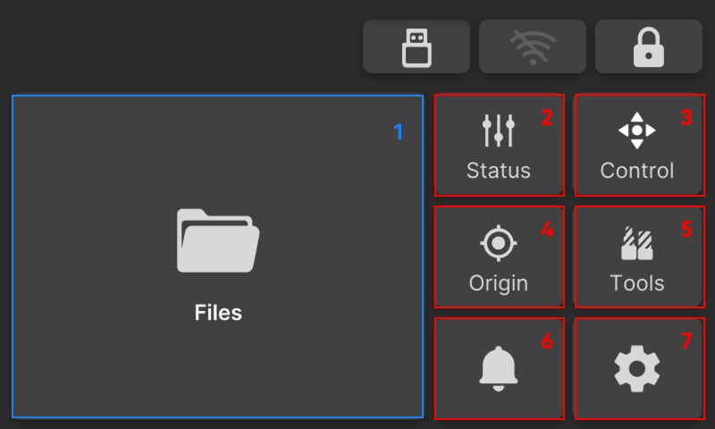

### Interface

NestPad provides an intuitive and reliable local control interface, allowing users to perform core operations such as file import, workpiece origin setup, machining monitoring, and accessory control without the need for a PC connection.

{width=12cm}

<!-- mdwb:figure id=e18aed79bf71e3bb -->
Figure 6-1 Interface
<!-- /mdwb:figure -->

| NO. | Function     | Description                                                                                                                                                                                       |
| --- | ------------ | ------------------------------------------------------------------------------------------------------------------------------------------------------------------------------------------------- |
| 1   | **Files**    | Browse program files stored locally or on a USB drive and start machining. When connected and logged in, users can also sync, access, and download favorite programs.                             |
| 2   | **Status**   | Displays real-time status of machine subsystems, including lighting, cleaning, cooling system monitoring, feed rate adjustment, and temperature monitoring.                                       |
| 3   | **Control**  | Spindle motion control. Supports manual **XYZ** axis movement and motion parameter adjustment, providing functions such as quick zero return, spindle reset, and manual workpiece origin setting. |
| 4   | **Origin**   | Guided workpiece origin setup. Directs the user to place the workpiece, automatically performs centering/alignment, and ultimately creates a new work coordinate system.                          |
| 5   | **Tools**    | Tool management, including tool change and return. Supports quick reading of RFID tool information, and allows spindle chuck and tool magazine control.                                           |
| 6   | **Messages** | Logs machine alerts and provides corresponding solutions.                                                                                                                                         |
| 7   | **Setting**  | Includes machine basic settings and user preference configurations.                                                                                                                               |

