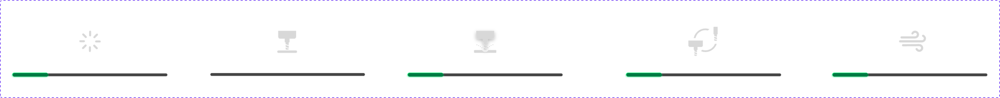

### Machining Status

{width=10cm}

<!-- mdwb:figure id=3e24cea1f932c481 -->
Figure 6-4 Machining Status
<!-- /mdwb:figure -->

During machining, the NestPad displays each stage using icons and text, providing an intuitive overview of the process:

- **File Loading**: File is being parsed from the PC, while checking for executable validity, parameters, and tool compatibility.  
- **Ready**: File preparation is complete and machining can be started.  
- **Machining**: Task is currently in progress.  
- **Tool Change**: The machine is performing a tool change.  
- **Worktable Cleaning**: At the end of the machining task, the fan automatically activates to clean the worktable.

