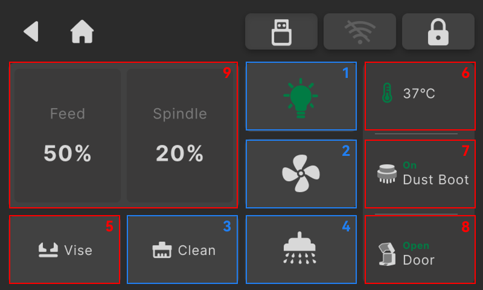

## Submodules and Accessories

This page provides control switches and status monitoring for all machine submodules, as well as settings for extended accessories.

{width=12cm}

<!-- mdwb:figure id=fb844933d170fc05 -->
Figure 6-5 Submodules and Accessories
<!-- /mdwb:figure -->

| No. | Module                         | Description                                                                                                                                                                                                                                                                                                                                                                                                        |
| --- | ------------------------------ | ------------------------------------------------------------------------------------------------------------------------------------------------------------------------------------------------------------------------------------------------------------------------------------------------------------------------------------------------------------------------------------------------------------------ |
| 1   | **Light**                          | Tap once to turn the enclosure interior light on or off.                                                                                                                                                                                                                                                                                                                                                           |
| 2   | **Fan**                            | Used for debris cleaning and airflow control, including:• **Air Purification**: Automatically enabled during machining and can be manually turned off for air circulation and exhaust ventilation.• **Chip Cleaning**: The bottom air-blow system removes chips toward the chip outlet for vacuum extraction.• **Worktable Cleaning**: The fan mounted above the spindle clears debris from the worktable surface. |
| 3   | **Chip Auger**                     | Located beneath the machine table and used to control the left, right, and front chip augers. When the safety door is closed, tap once to start. When the safety door is open, press and hold to operate, and release to stop.                                                                                                                                                                                     |
| 4   | **Coolant**                        | Controls the left and right coolant tank spray switches. The system displays a notification when the coolant level is too low.                                                                                                                                                                                                                                                                                     |
| 5   | **Vise**                           | Supports press-and-hold operation. When the vise is fully clamped, the system displays the message “Vise Fully Clamped.”                                                                                                                                                                                                                                                                                           |
| 6   | **Spindle Temperature Monitoring** | Continuously monitors spindle temperature. When the temperature exceeds the safety threshold, the system displays a warning message. If the temperature rises above 70°C, machining will automatically stop and the device will be locked until the spindle cools down to a safe temperature range.                                                                                                                |
| 7   | **Shoe Detection**                 | Detects the installation status of the dust shoe in real time. When the dust shoe is installed, certain functions will be automatically restricted to prevent machining interference or reduced dust collection performance.                                                                                                                                                                                       |
| 8   | **Door Detection**                 | Continuously monitors the safety door status. When Safety Mode is enabled and the door is opened, the current machining task will automatically pause and spindle movement will be restricted to reduce the risk of personal injury caused by improper operation.                                                                                                                                                  |
| 9   | **Feed & Spindle**                 | Allows adjustment of feed rate and spindle speed override during machining. Changes take effect after confirmation. Once the current task is completed, the override values will automatically return to the default 100% setting before the next machining task starts.                                                                                                                                           |

