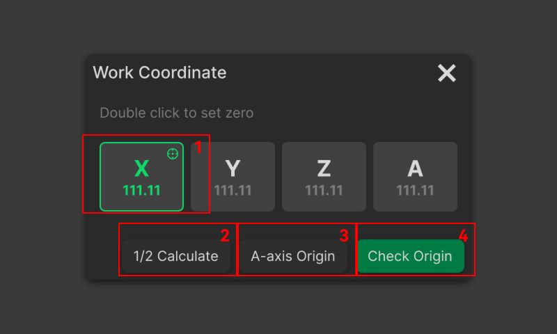

### Coordinate System Setup

The left side of the interface displays the current machine coordinates and work coordinate system in real time, providing reference for workpiece origin calibration. Users can click the work coordinate system to check it, double-click or use the relevant buttons to set the zero point.

{width=12cm}

<!-- mdwb:figure id=d5553290d700998c -->
Figure 6-7 Coordinate System Setup
<!-- /mdwb:figure -->

| No. | Module              | Description                                                                                                                                                                                                                                                |
| --- | ------------------- | ---------------------------------------------------------------------------------------------------------------------------------------------------------------------------------------------------------------------------------------------------------- |
| 1   | **Set Zero**        | Select an axis, then double-click the axis value to set it as zero.                                                                                                                                                                                        |
| 2   | **1/2 Calculate**   | After selecting an axis, click this button to automatically calculate the 1/2 position based on the current axis value and set it as zero. Users do not need to calculate the value manually or move the spindle to the corresponding coordinate position. |
| 3   | **4th-Axis Homing** | Click the button to automatically rotate the 4th-Axis to the preset work zero position.                                                                                                                                                                    |
| 4   | **Check Origin**    | Click this button to move the spindle to the newly set work origin, allowing users to check whether the origin position is correct.                                                                                                                        |

