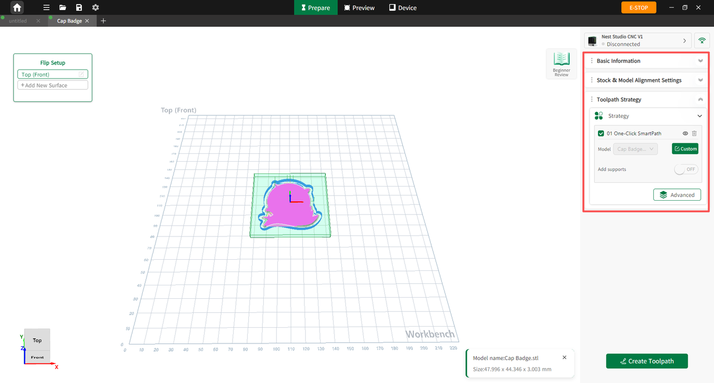

## Configuring Machining Parameters

Before starting machining, configure the material, model, and machining parameters as required:

1. Select the stock material and enter its dimensions, or scan the material QR code to automatically retrieve the material type and size information.
2. Adjust the relative position between the model and the stock material according to machining requirements. By default, the software automatically centers and aligns the model.
3. After the model is imported, the system automatically generates a **Smart Milling** process card. For initial machining, manual tool or machining parameter configuration is not required.

{width=12cm}

<!-- mdwb:figure id=1c413ac81fae37f9 -->
Figure 7-3 Configuring Machining Parameters
<!-- /mdwb:figure -->

