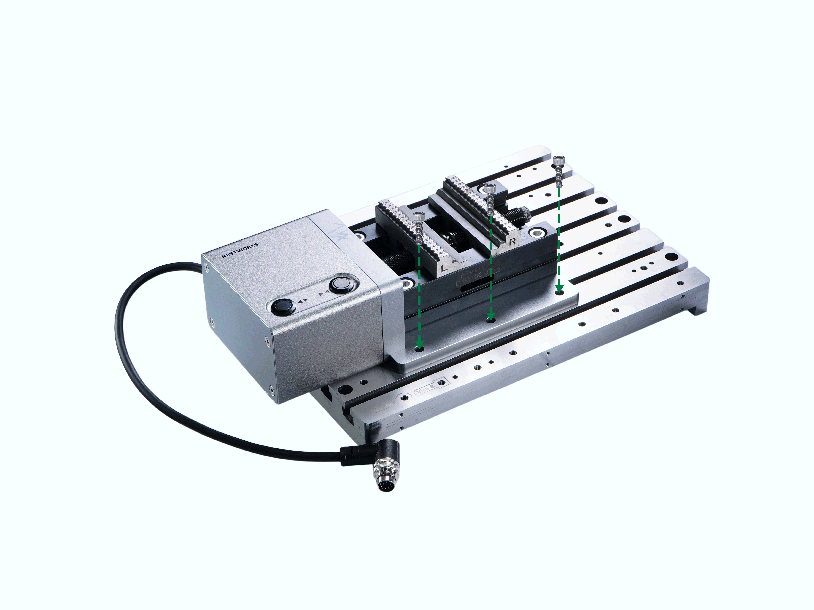
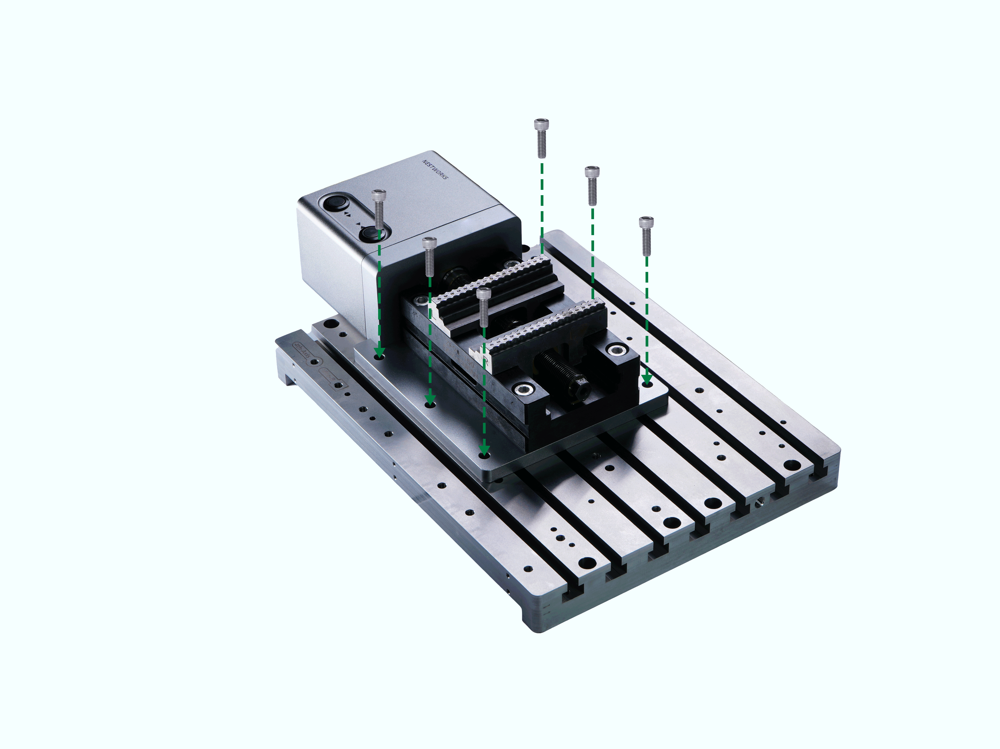
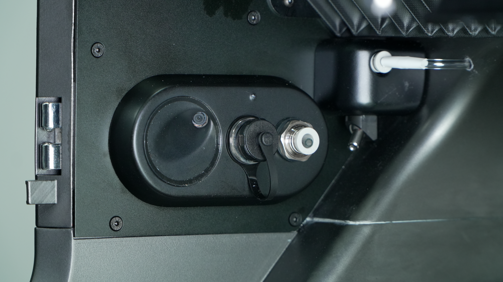

#### Installation Steps

1. Align the front mounting through-holes on the motor side of the electric vise base plate with the threaded holes marked Vise-A and Vise-B on the worktable to determine the installation position.  

2. Insert 6 pcs M6×18 hex socket screws through the mounting holes on the electric vise base plate and tighten them using a 5 mm hex key to complete structural installation.  

3. Locate the female 4th-Axis/vise aviation connector inside the machining chamber. Align the keying points on the male and female connectors, then insert the electric vise aviation plug into the connector socket. Manually tighten the lock nut to secure the connection.

{width=12cm}

> [!caution] Caution  
> 
> Do not connect or disconnect the aviation plug while the machine is powered on.

> [!note] Note  
> 
> After installation, power on the machine and enter the control system. NestPad displays the vise connection status. If the vise is not detected, check whether the wiring and vise are functioning properly.

4. Power on the machine or release the E-Stop. Close the protective cover, then click **Home Reset**. Wait until the machine completes the homing process. The electric vise installation is then complete.

> [!caution] Caution  
> - Fully tighten the vise mounting screws, especially when machining heavy workpieces. A loose vise may cause the workpiece to be ejected and create a safety hazard.  
> - Ensure that the workpiece is securely clamped. Do not apply excessive clamping force, as this may deform the workpiece.  
> - After machining, release the vise promptly. Remove debris, chips, and residual liquid from the vise jaws and worktable surface.

> [!note] Note  
> If the vise will not be used for an extended period, use an air gun to remove residual chips from the vise body, jaws, and lead screw. Apply anti-rust oil evenly, then place the vise back in its packaging box and store it in a sealed condition.
