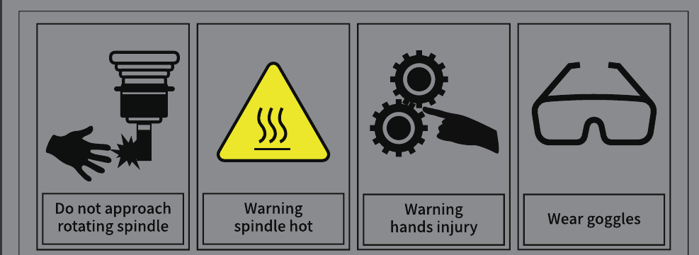
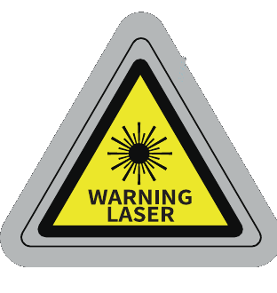
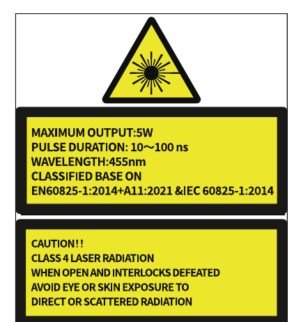
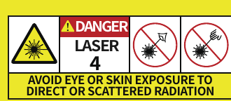
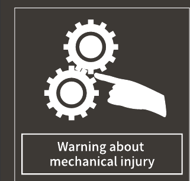
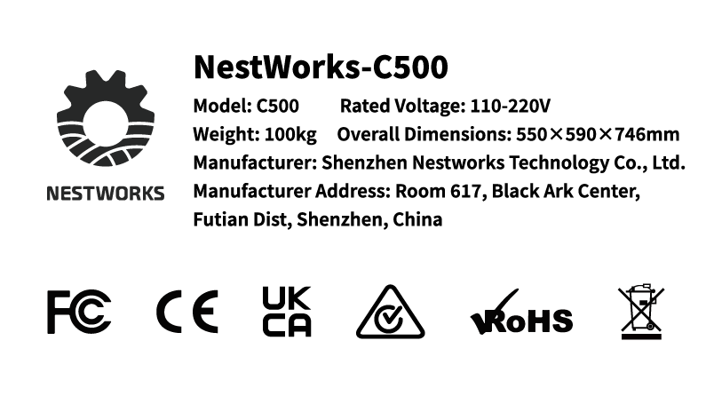

## 安全符号与标签

设备安全标签需保持完好清晰，破损、褪色或脱落请立即联系经销商更换。
设备所有安全标签为永久警示部件，用户不得撕除、遮盖、涂改。

**表 2-1 安全符号与标签** <!-- mdwb:table id=cb14e79b4c22aeb8 -->

| 安全标签                                                                            | 位置      | 说明                                                           |
| ------------------------------------------------------------------------------- | ------- | ------------------------------------------------------------ |
| {width=3cm} | 主轴外壳    | 从左至右：手部远离主轴；注意主轴高温；手部远离运动部件；进行铣削加工时请佩戴防护眼镜，使用激光功能时请佩戴激光防护眼镜。 |
| {width=3cm}                | 小屏幕附件   | 4 类激光产品。避免眼睛或皮肤暴露于直接或散射激光辐射。                                 |
| {width=3cm}   | 主机外壳    | 激光外部警示标贴。                                                    |
| {width=3cm}         | 主机外壳    | 激光标识和参数。                                                     |
| {width=3cm}      | 激光模块盖子上 | 从左至右：激光警示标贴；4 类激光产品；避免眼睛或皮肤暴露于直接或散射激光辐射。                     |
| {width=3cm}           | 排渣口处    | 防夹手标贴。                                                       |
| {width=3cm}           | 第四轴     | 手部远离第四轴。                                                     |
| {width=3cm}           | 机用虎钳    | 手部远离机用虎钳。                                                    |
| {width=3cm}           | 电源接口附近  | 提供设备识别及认证信息。                                                 |