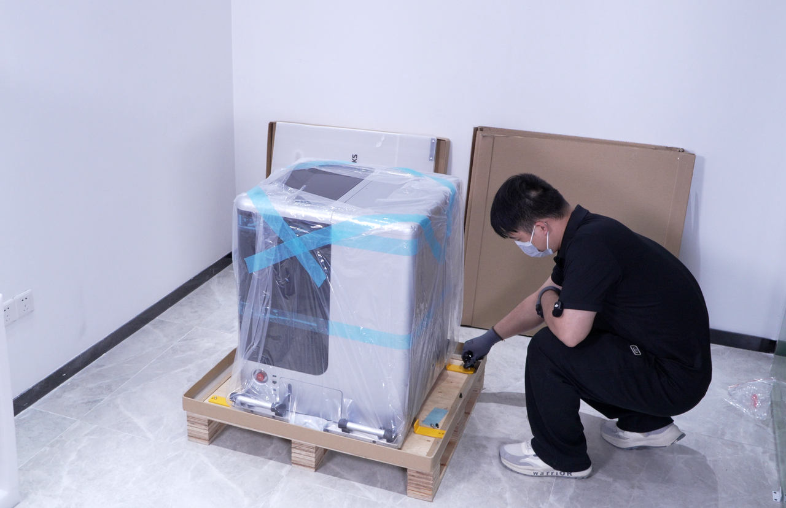
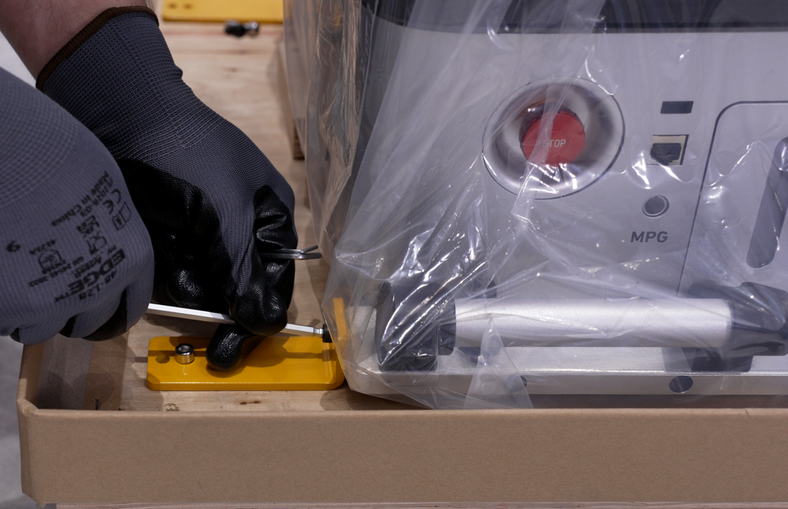
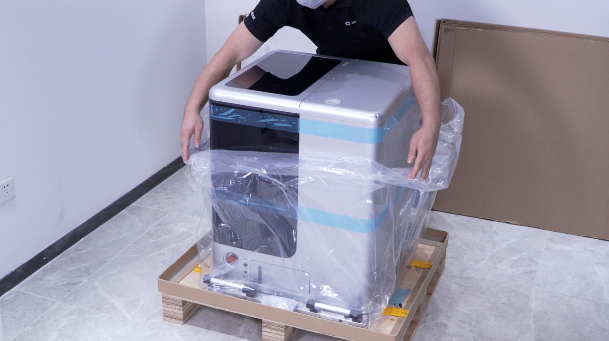
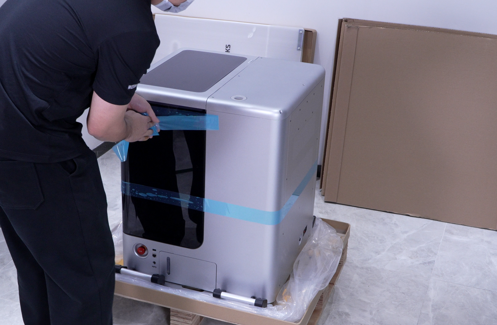

#### 主机运输固定钣金拆除

完成外部包装拆除后，按以下步骤拆除主机与运输托盘之间的四组固定钣金。

1. 使用 5 mm 内六角扳手拆除机身四组主机运输固定钣金的固定螺丝，并依次取下全部运输固定钣金。

{width=10cm}

2. 拆除过程中应顺势拆卸，不得强行撬动或敲击设备机身，避免造成机身划伤、结构变形或螺丝滑丝。

{width=10cm}

3. 缓慢取下设备内包装袋，避免刮擦设备表面。

{width=10cm}

4. 撕除设备机身表面的固定胶带。

{width=10cm}

5. 保留主机运输把手、主轴与工作台固定钣金及内部运输防护材料，按照[搬运安全要求](https://docs.worksbase.com/zh/transport-deployment#%E6%90%AC%E8%BF%90%E5%AE%89%E5%85%A8%E8%A6%81%E6%B1%82)将设备搬运至最终使用位置，并平稳放置在工作台上。

