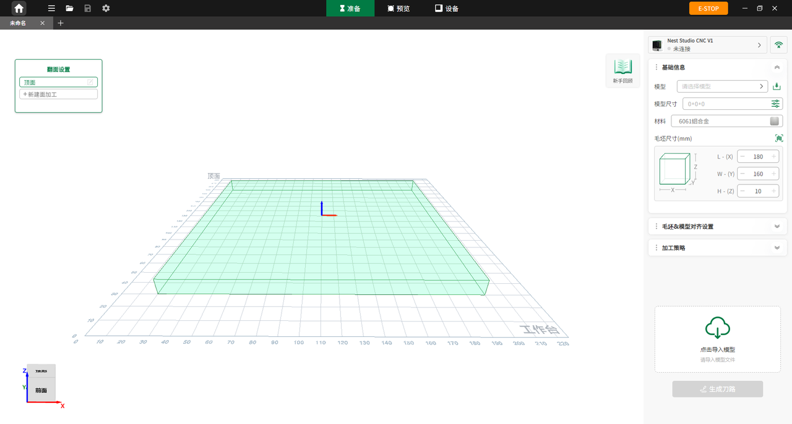

### 软件介绍

**NestStudio** 是一款专为桌面级 CNC 设备打造的轻量化编程与协同控制软件。通过高度整合的项目制工作流、智能刀路算法以及直观易用的交互界面，为初学者和专业用户提供高效、流畅的 CNC 加工体验。

{width=12cm}

<!-- mdwb:figure id=6ad1c56c8990aacd -->
图 5-1 软件获取与安装
<!-- /mdwb:figure -->

