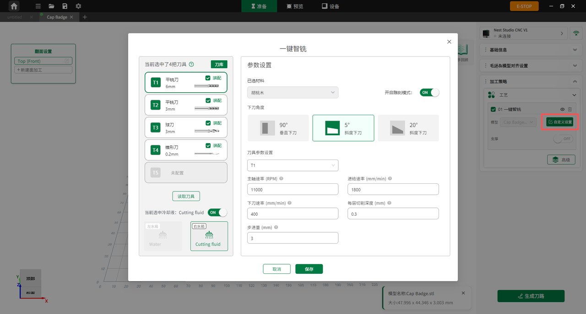

#### 自定义设置

**一键智铣**

进入**一键智铣**界面，用户可以根据实际需求调整刀具（如下刀角度、主轴转速、进给速度、步进量等）以及冷却液等核心加工参数。

{width=12cm}

<!-- mdwb:figure id=723f1a43ae2118e0 -->
图 6-12 一键智铣
<!-- /mdwb:figure -->

**支撑设置**

用户可在此处设置支撑的开启与关闭，并调整其高度、长度及生成位置：

* 智能生成：模型导入后，软件会自动识别模型的悬空部位与结构比例，并自动添加支撑。若关闭该功能，则不会生成任何支撑。
* 预留支撑：用户可在此处自定义设置支撑与模型主体之间的间隙距离。

**高级设置**

系统在高级模块中提供了更精细化的工艺配置，涵盖攻牙、倒角、雕刻、轮廓、区域等多种高级加工方式：

{width=12cm}

<!-- mdwb:figure id=3a1d4b3a7e8fdc74 -->
图 6-13 高级设置
<!-- /mdwb:figure -->

* 多工序加工：高级设置支持在一键智铣之外，为模型额外添加钻孔等特定加工工序，满足复杂零件的多工序加工需求。
* 智能参数推荐：在高级设置中，软件会基于每种特定工序智能推荐最匹配的加工参数，无需用户手动逐一设置。

