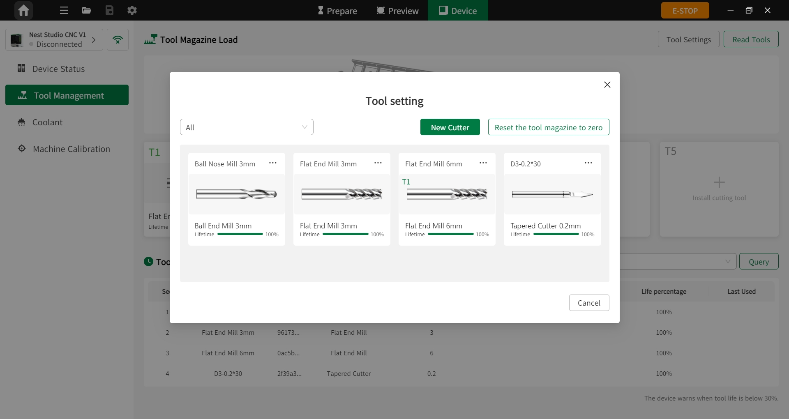

#### RFID 标签与刀具绑定

1. 刀具放置  

将已装配刀套的刀具平稳放入刀库指定刀位，确保刀具安装牢固且无松动，并确认刀位编号与系统操作对应一致。  

2. 系统操作  
设备开机并完成自检后，进入系统主界面，点击 **刀具管理 > 刀具设置**。  

{width=12cm}

<!-- mdwb:figure id=a884dfaaa3844be6 -->
图 8-1 RFID 标签与刀具绑定
<!-- /mdwb:figure -->

系统自动启动 RFID 读取模块，并读取当前刀位中的刀具标签信息。若读取失败，请检查 RFID 标签安装位置及刀具是否安装到位。  

3. 刀具读取  

PC 端 **NestStudio** 与设备端 **NestPad** 均支持快速读取刀具信息。系统将按照 T1 ~ T5 刀位顺序依次读取，并通过提示音反馈读取状态。用户确认后即可写入系统。  

- **NestStudio**  

  进入 **设备 > 刀具管理**，点击 **读取刀具**，快速读取刀库中的刀具信息。确认后，刀具数据将写入系统，用于后续一键智铣及刀路生成。  

- **NestPad**  

  进入 **刀具** 页面后，点击 **扫描刀具** 读取刀具信息，确认后即可写入系统。  

4. 信息录入与确认  

在绑定界面中，录入刀具规格、型号、刀具长度、刃口类型及最大切削参数等信息。确认无误后，点击 **确认绑定**。  

系统将自动完成 RFID 标签 ID 与刀具信息的关联存储，后续可随时在刀具管理界面中查看对应刀具信息。

