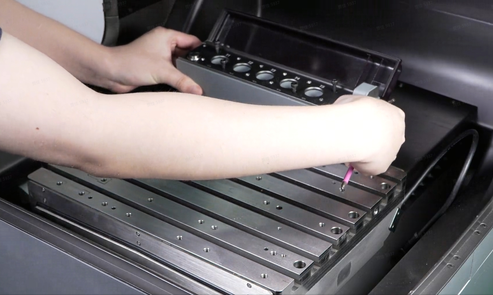
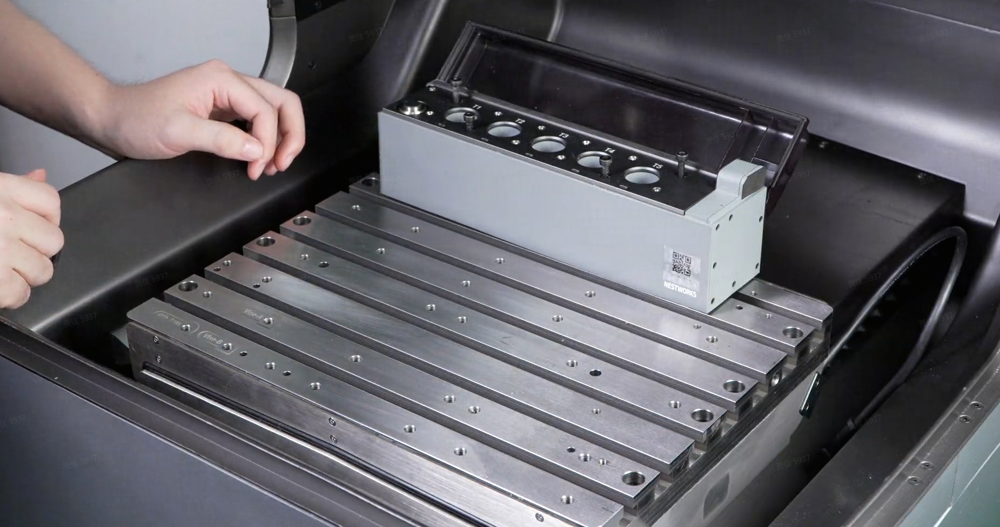
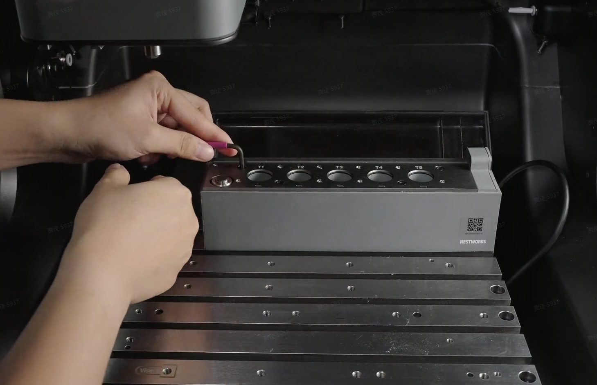
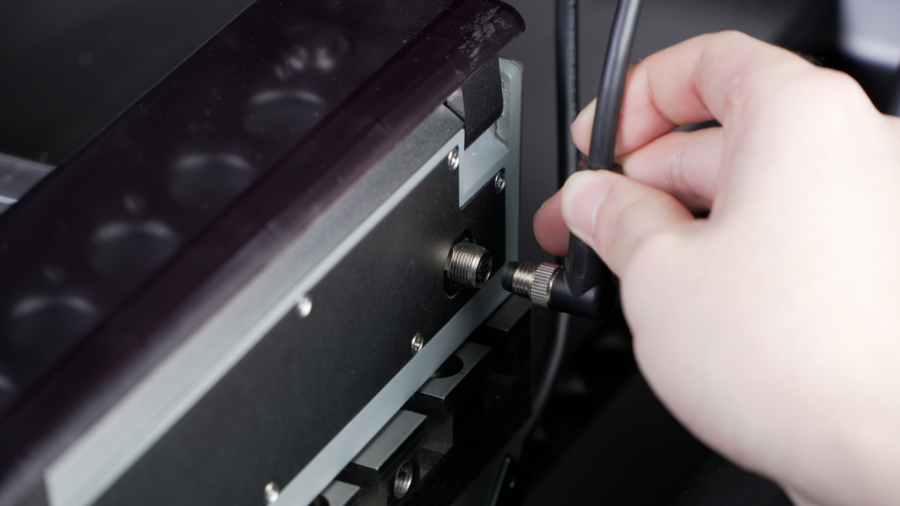

#### 右侧切换至右后侧安装 

a. 将两只 4×10 圆柱销植入工作台右后侧的定位孔内 

{width=10cm}

b. 刀库带 Logo 正面朝向操作人员，对准圆柱销孔位平稳落座。

{width=10cm}

c. 拧入 4 颗 M4×60 螺丝并均匀锁紧，完成刀库固定。

{width=10cm}

d. 取下刀库左后侧航空插座的防水盖，接入航空插头并拧紧螺母；将防水盖复位至空置的右后侧航空插座上。  

{width=10cm}

e. 开机上电，进入系统确认刀库位置识别正常，无报错后即可使用。

