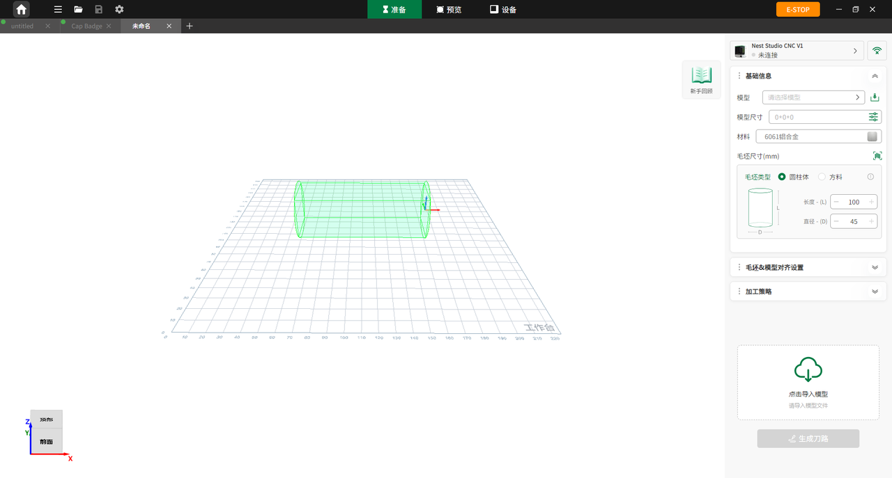

### PC 端操作

软件与设备连接后，若第四轴已接入并被识别，用户可在控制台单独执行 A 轴回零操作。

在第四轴模式中，用户可导入 3D 模型进行旋转加工。第四轴模式与三轴模式略有不同，除设置毛坯长度、宽度、高度等基础尺寸外，也支持在圆柱体和方料之间切换，并设置旋转加工相关参数。

第四轴刀路的常见加工参数包括毛坯尺寸、毛坯与模型对齐方式、刀具参数。完成相关参数设置后，可点击 **生成刀路**，并在预览页面查看加工文件信息。

{width=12cm}

<!-- mdwb:figure id=f69199d13cbd6d85 -->
图 8-12 PC 端操作
<!-- /mdwb:figure -->

