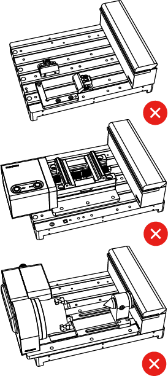
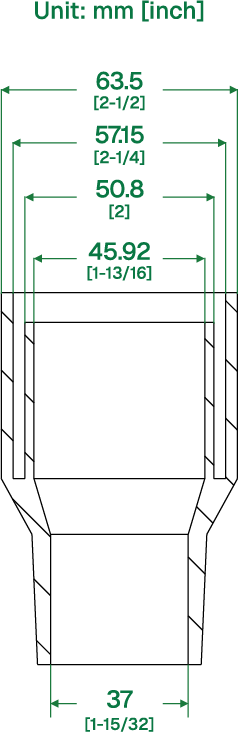
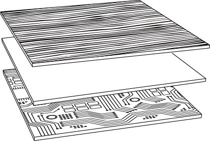
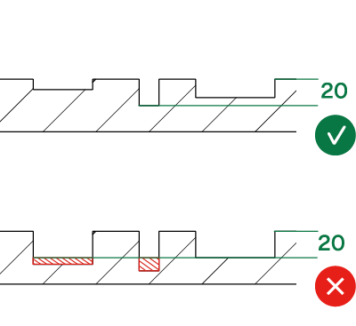
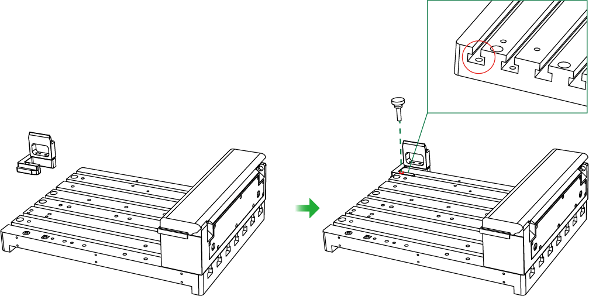
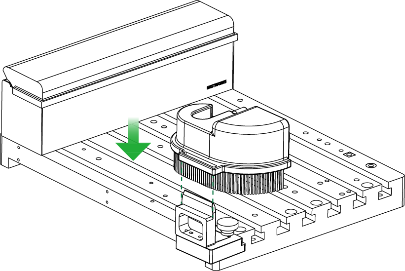
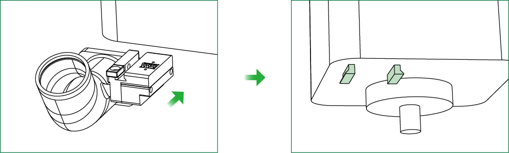
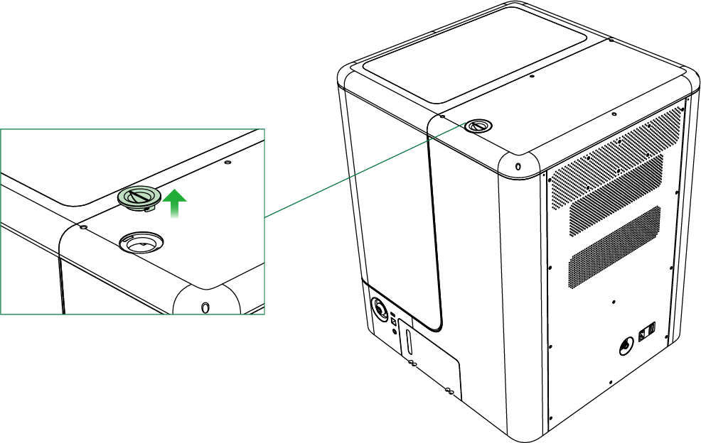
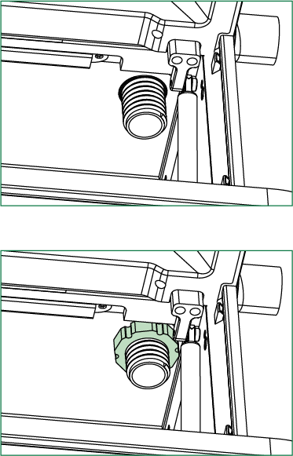
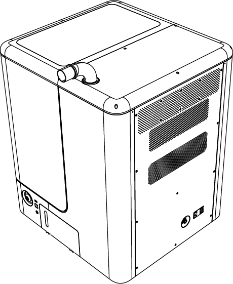

## Dust Shoe Installation

The Dust Shoe must be used with an external dust extractor. It collects dust and debris generated during machining and helps keep the work area clean. Before use, connect the Dust Shoe to the external dust extractor using the dust extraction hose and adapters.

### Notes

{width=5cm gap=3cm} {width=4cm}

> [!caution] Caution
> - The Dust Shoe must be used with an external dust extractor. The included Universal Hose Adapter fits four common dust extractor hose sizes.
> - Do not use the Dust Shoe with machining accessories such as the Electric Vise, 4th-Axis Module, or Fixture Kit.

{width=5cm} {width=5cm}

> [!caution] Caution
> - The Dust Shoe is suitable for machining wood, plastic, and aluminum sheets. Do not use cutting fluid when machining aluminum.
> - With the Dust Shoe installed, the maximum cutting depth is 20 mm. Remove the Dust Shoe before machining if the cutting depth exceeds 20 mm.

### Installation Preparation

Before installation, make sure the following components and equipment are available: brush holder, thumb nut, Magnetic Brush Assembly, Spindle Dust Extraction Adapter, dust extraction hose, L-shaped adapter, Universal Hose Adapter, and external dust extractor.

{width=10cm}

| No. | Component |
|---:|---|
| 1 | Spindle Dust Extraction Adapter |
| 2 | Magnetic Brush Assembly |
| 3 | Universal Hose Adapter |

### Installation

#### Installing the Dust Shoe

1. Insert the brush holder into the slot at the rear left of the machine bed.
2. Secure the brush holder with the thumb nut.

{width=12cm}

3. Attach the Magnetic Brush Assembly to the brush holder.

{width=10cm}

4. Align the Spindle Dust Extraction Adapter with the slot on the spindle and slide it into place. A noticeable stop during insertion indicates that it is fully installed.

{width=12cm}

#### Connecting the Dust Extraction Hose

1. Remove the dust port cover from the top of the enclosure.

{width=10cm}

2. Insert the L-shaped adapter into the enclosure port, then secure it from inside the enclosure with the thumb nut.

{width=6cm}

3. From inside the enclosure, connect the threaded end of the dust extraction hose to the L-shaped adapter and tighten it.
4. Connect the other end of the hose to the Spindle Dust Extraction Adapter.

{width=10cm}

5. Attach the Universal Hose Adapter to the L-shaped adapter, then connect it to an external dust extractor.

{width=10cm}

6. After installation, make sure all connections are secure and that the dust extraction hose is not bent or pinched.

### Operation and Cleaning

- During machining, keep the external dust extractor running to remove dust and debris promptly and prevent buildup from affecting machining accuracy or shortening the service life of the machine.

- After machining, switch off the external dust extractor and disconnect it from the power supply. Empty the dust container, and clean the dust extraction hose and dust port to prevent blockages.

- Check the dust extractor filter regularly. If the filter is clogged, clean or replace it promptly to maintain proper suction.
