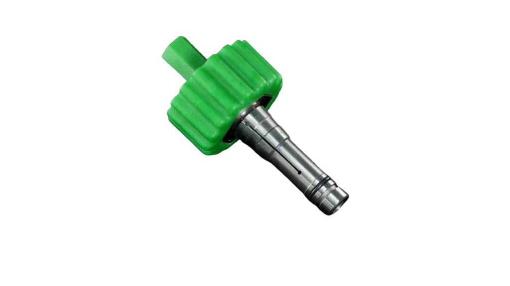
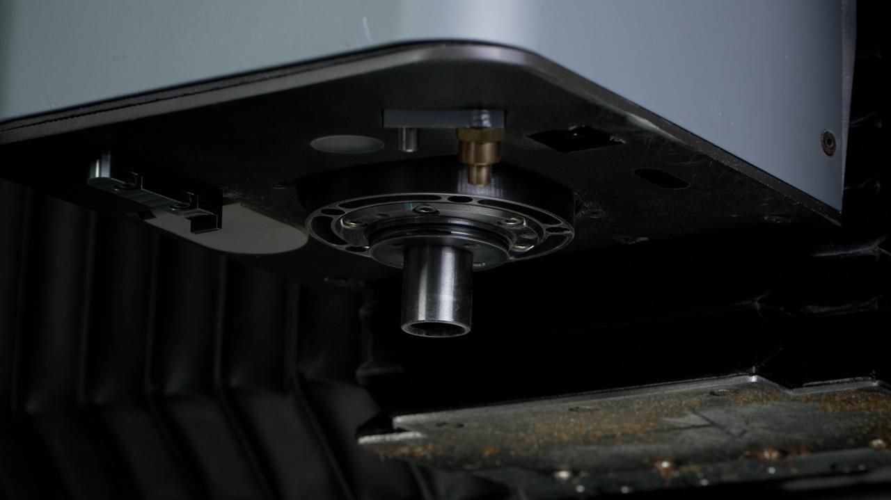
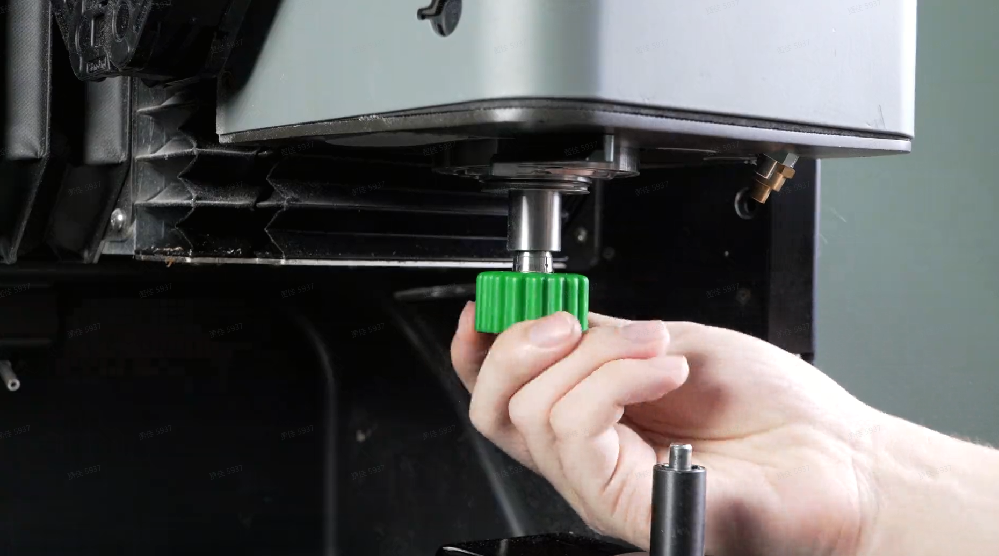

#### 主轴夹头安装与锁紧

1. 根据所选刀具规格，选择对应的夹头（夹头内径需与刀具柄径一致）。

{width=8cm}

2. 将主轴调整为松刀状态。

{width=10cm}

3. 将夹头放在专用夹头安装工具上，放入主轴逆时针拧紧。

{width=10cm}

> [!note] 提示
> 建议定期对夹头进行保养。拆下夹头后，可使用酒精清洁夹头及主轴内锥孔，清洁完成后在内锥孔表面涂抹薄层润滑脂，重新安装夹头。

