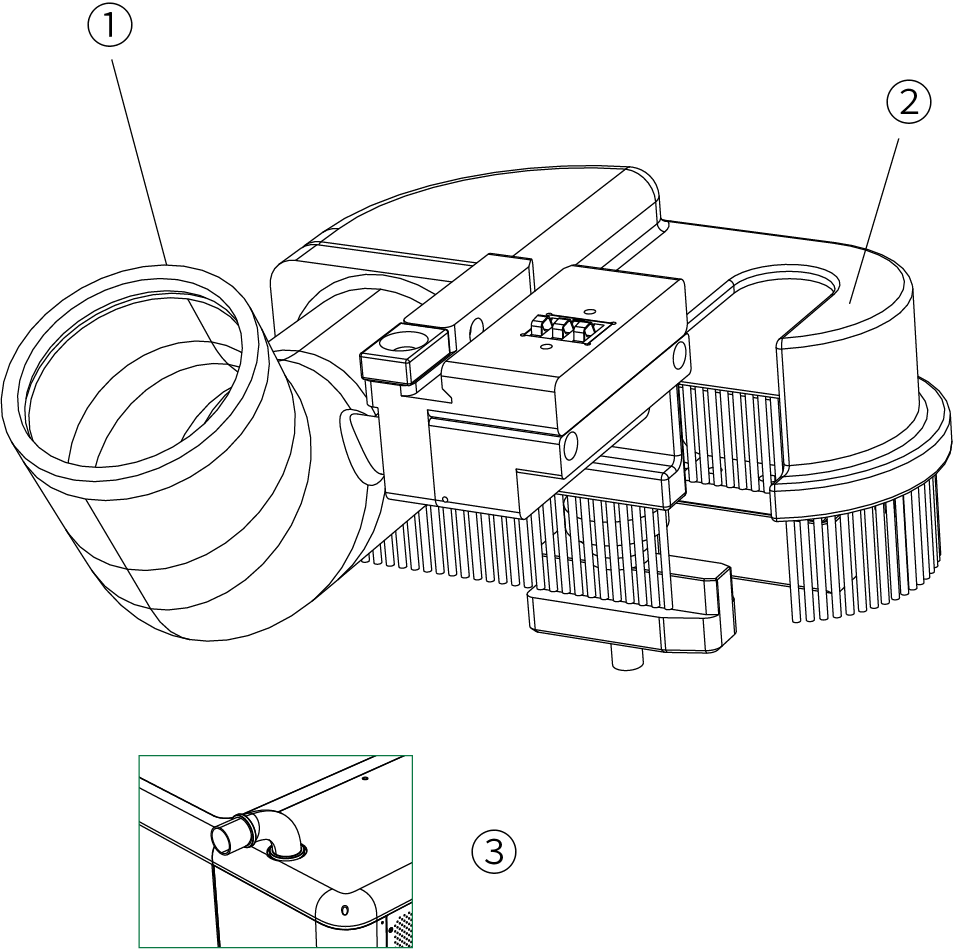
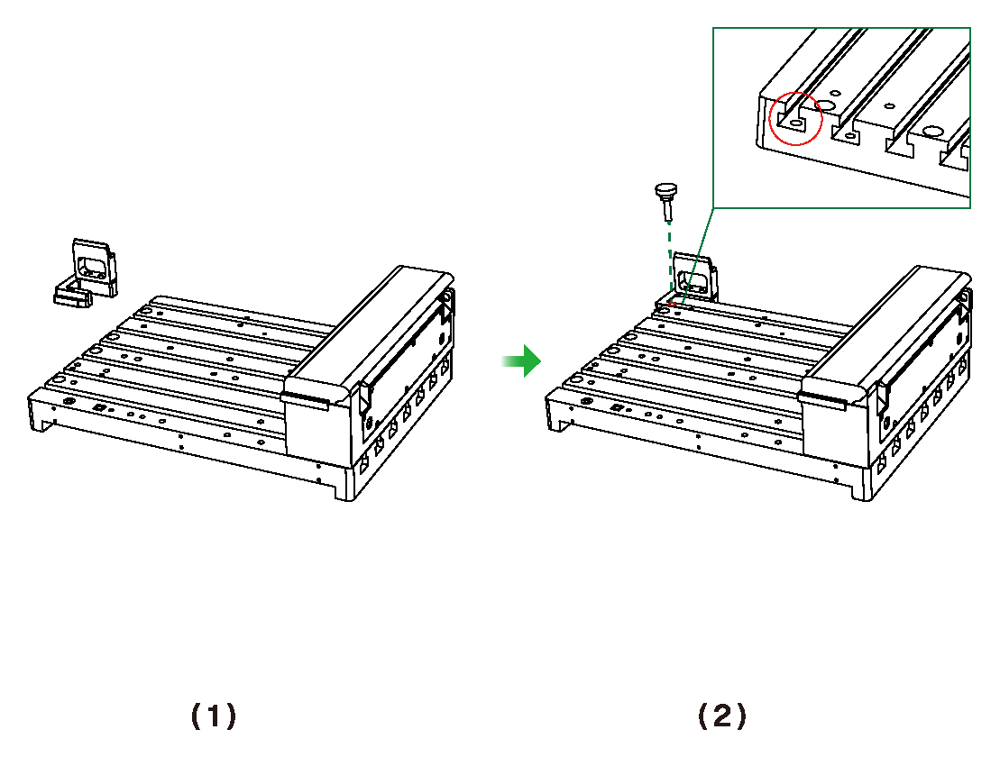
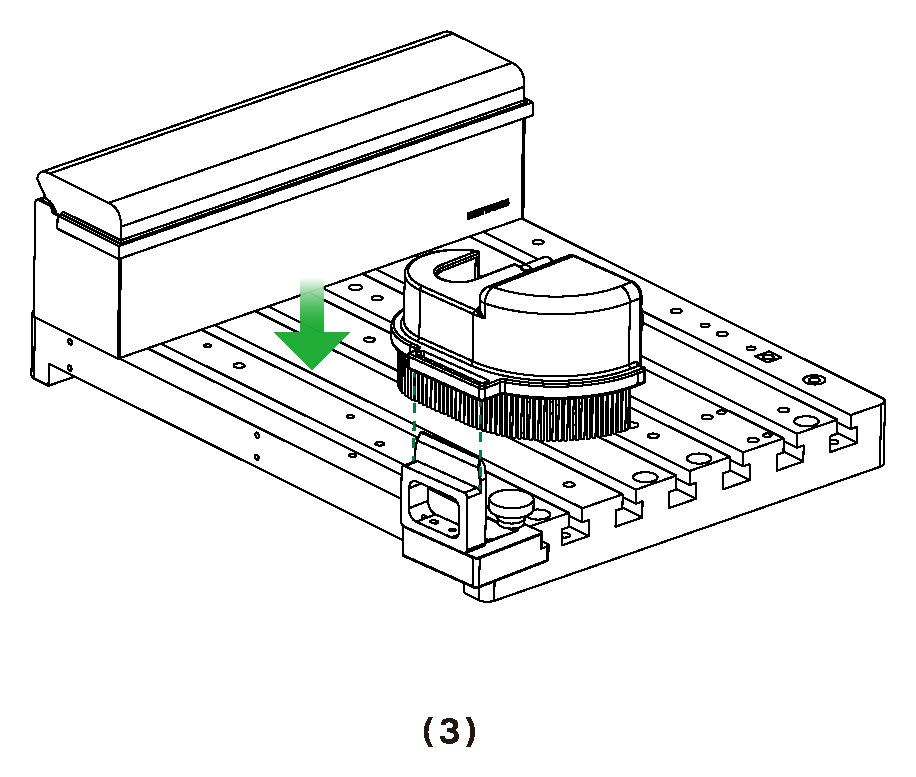
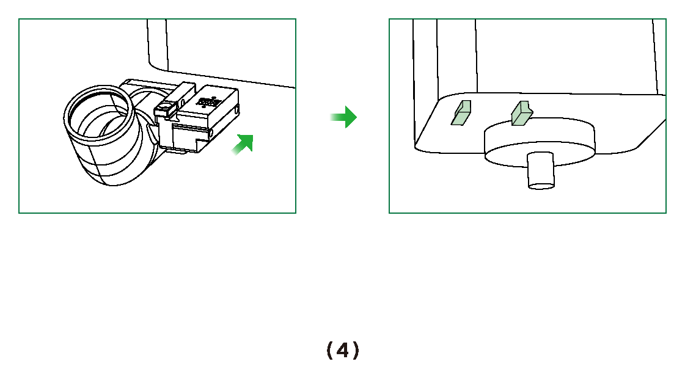
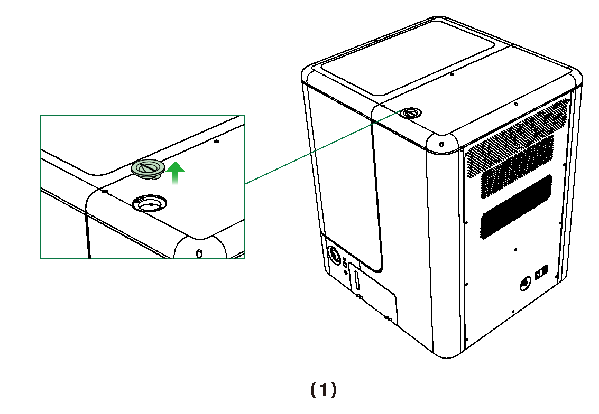
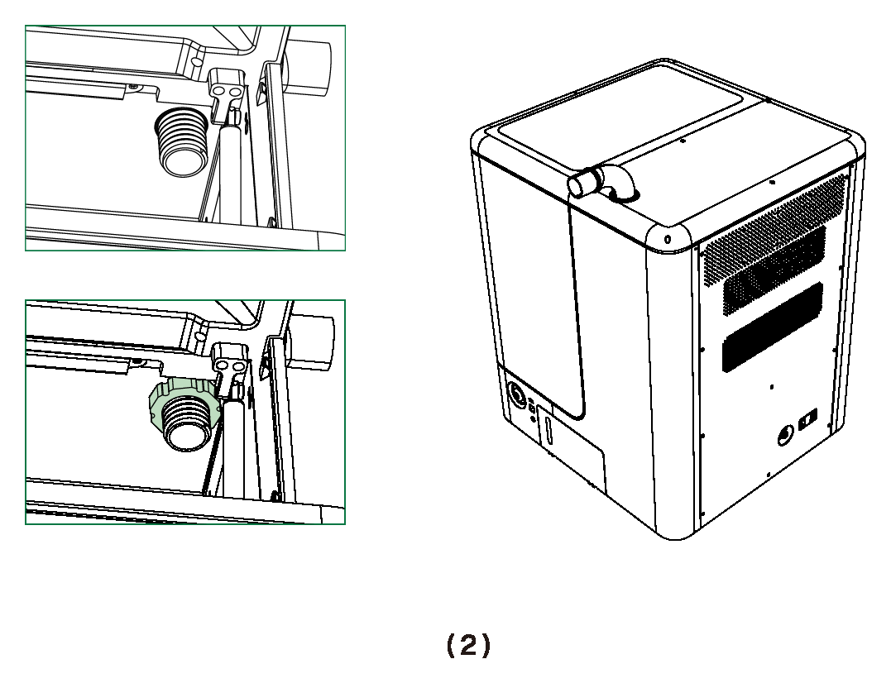
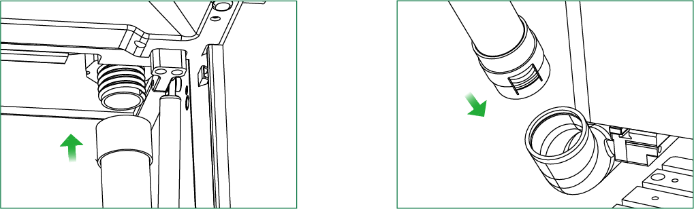

# 集尘毛刷与吸尘器安装

集尘毛刷需与外部吸尘器配合使用，用于收集加工过程中产生的碎屑和粉尘，保持工作区域清洁。使用前，请通过吸尘管和转接件将集尘毛刷与外部吸尘器连接。

## 注意事项

> [!caution] 注意
> - 集尘毛刷需配合外部吸尘器使用，随附的万能尺寸接头兼容四种常见的吸尘器管径。
> - 集尘毛刷不可与电动虎钳、第四轴组件、夹具套件等切削相关组件同时使用。
> - 集尘毛刷适用于木材、塑料及铝制板材的加工。加工铝材时请勿使用切削液。
> - 安装集尘毛刷后，最大加工深度为 20 mm。加工深度超过 20 mm 时，请在加工前拆除集尘毛刷。

## 安装前准备

安装前，请确认所需部件和设备齐全：毛刷停靠座、手拧螺母、磁吸毛刷本体、主轴吸尘转接座、吸尘管、L 型转接口、万能尺寸接头及外部吸尘器。

{width=10cm}

### 安装集尘毛刷

1. 将毛刷停靠座插入平台左后侧的插槽。

   {width=12cm}

2. 使用手拧螺母将毛刷停靠座固定在平台左后侧。

   {width=12cm}

3. 将磁吸毛刷本体安装到毛刷停靠座上。

   {width=10cm}

4. 将主轴吸尘转接座通过插槽安装到主轴上。

   {width=12cm}

### 连接吸尘管

1. 取下机箱顶部的吸尘接口盖。

   {width=10cm}

2. 安装 L 型转接口，并从机箱内侧使用手拧螺母固定。

   {width=10cm}

3. 从机箱内侧将吸尘管连接到 L 型转接口。

   {width=10cm}

4. 将吸尘管的另一端连接到主轴吸尘转接座。

   {width=10cm}

5. 将万能尺寸接头安装到 L 型转接口上，然后连接外部吸尘器。

   {width=10cm}

安装完成后，确认各连接位置固定牢固，并确保吸尘管没有弯折或受到挤压。

## 使用与清洁

- 加工过程中，建议开启外部吸尘器，及时清除加工产生的碎屑和粉尘，避免粉尘堆积影响加工精度及设备寿命。

- 加工完成后，关闭吸尘器并断开电源，及时清理集尘盒中的碎屑和粉尘，同时清洁吸尘管、主轴吸尘转接座及磁吸毛刷本体，避免堵塞。

- 建议定期检查吸尘器滤网状态。滤网堵塞时，应及时清理或更换，以保证吸力正常。
111111111111111111111111