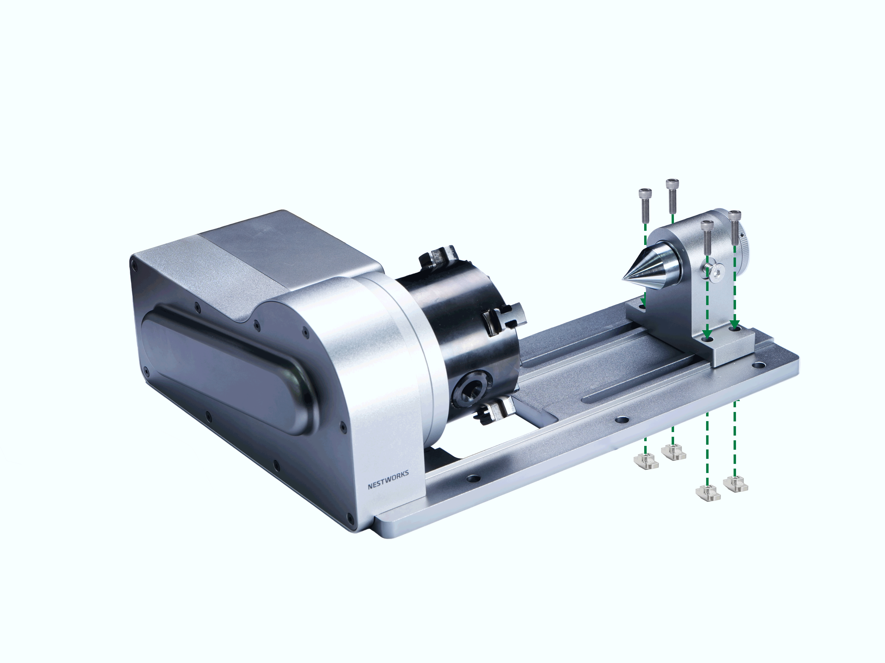
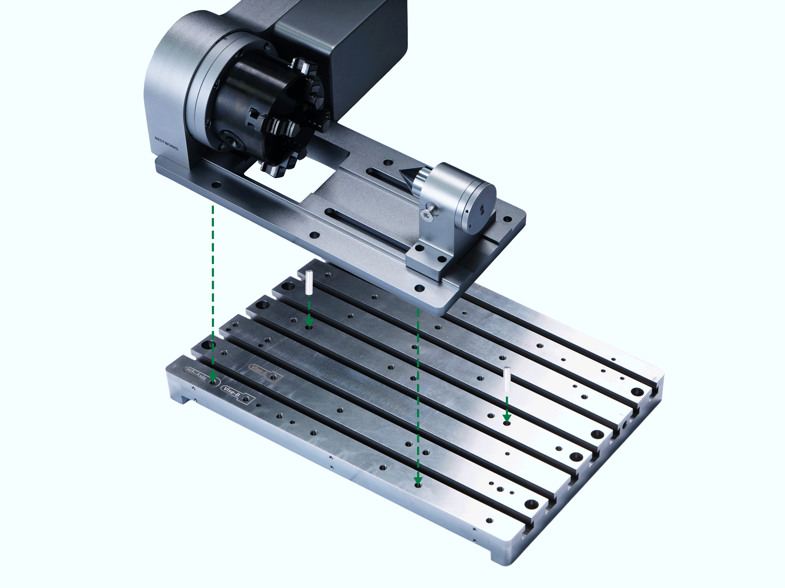
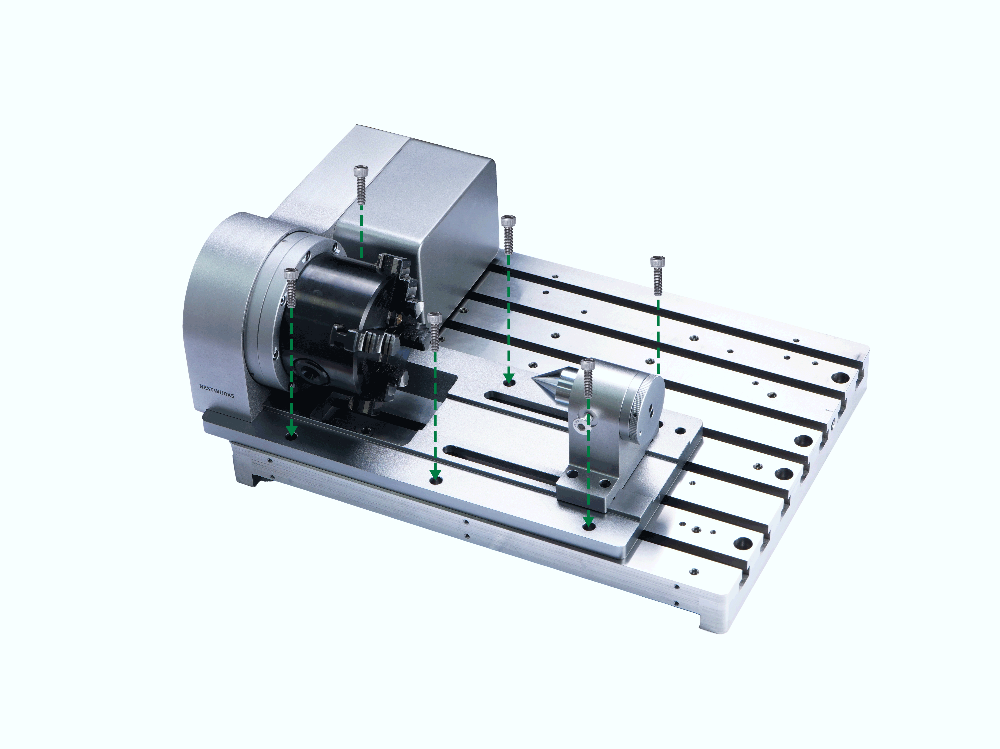

#### 安装步骤

1. 将顶针尾座的顶针朝向第四轴卡爪方向放置于底板上，使用 4 颗 M6×20 内六角螺钉及 4 个 M6 滑动螺母预锁固定。  

{width=10cm}

2. 将 φ6×20 定位销钉轻压安装至工作台对应定位孔中，再通过第四轴底板上的定位孔与销钉配合，确定第四轴与工作台的安装位置。

> [!note] 提示
> 可结合工作台面标识的 4th-Axis 螺纹孔辅助定位。  

{width=10cm}

3. 使用 6 颗 M6×18 内六角螺钉穿过第四轴底板安装孔，用 5 mm 内六角扳手锁紧，完成第四轴结构安装。  

{width=10cm}

4. 确认机台处于关机状态，在加工仓内找到第四轴和虎钳接线航空插头母头，对准航空插头公头与母头的防呆点后，将第四轴航空插头接入设备航空插头母头，并手动拧紧锁固螺母，完成信号连接安装。  

5. 启动设备或松开 **急停** 按钮后，关闭防护门并点击 **复位回零**。 等待设备完成整机回零后，手动轻轻转动第四轴卡盘，检查卡盘是否固定稳固且无明显回转间隙，确认无松动后，完成安装。

