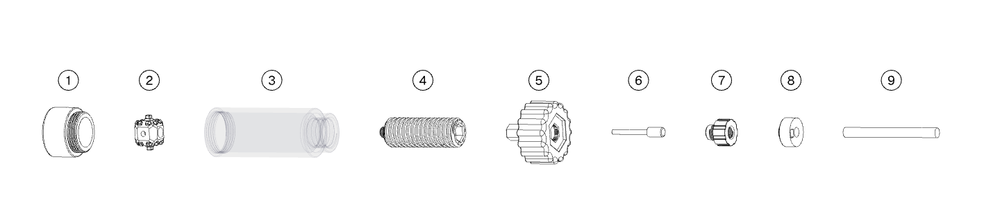

#### 刀套拆装筒

铣刀需装入配套刀套中，方可配合本设备使用。铣刀属于易损品，使用过程中易发生断裂或磨损，需定期更换。铣刀装入刀套后，还需装入对应直径筒夹中，配套主轴进行切削。

铣刀分为 Φ3 mm、Φ3.15 mm、Φ6 mm、Φ6.35 mm 四种直径规格，刀套和筒夹对应设置四种规格以适配不同铣刀。刀套拆装筒可同时适配上述四种规格。

刀套拆装筒主要用于将铣刀过盈装配进刀套中，或将铣刀从刀套中拆出，同时也可用于筒夹的拆装。

{width=12cm}

<!-- mdwb:figure id=b13047f7fd2315a0 -->
图 4-7 刀套拆装筒
<!-- /mdwb:figure -->

| 序号  | 名称    | 说明                                                   |
| --- | ----- | ---------------------------------------------------- |
| 1   | 前盖    | 方便放入刀套并定位                                            |
| 2   | 铣刀固定块 | 穿有两个互相垂直的孔，分别适配 3/3.15 mm 与 6/6.35 mm 铣刀，防止装入过程中发生偏斜 |
| 3   | 透明中间筒 | 起到主要受力作用，透明结构便于观察螺杆位置                                |
| 4   | 螺杆    | 通过螺旋产生推力，推动铣刀装入或卸出刀套                                 |
| 5   | 拧盖    | 方便人手握紧发力，将力矩传递到螺杆，另一侧可装卸筒夹                           |
| 6   | 销钉    | 卸刀过程中将铣刀从刀套中顶出                                       |
| 7   | 销钉安装件 | 在不进行卸刀时收纳销钉，在进行卸刀过程中对销钉起到辅助固定防止偏斜功能                  |
| 8   | 刀套    | 带有RFID标签，机器自动读取铣刀相关信息，同步在筒夹装刀时可有效定位铣刀高度              |
| 9   | 铣刀    | 标准件，有多种规格，用于CNC加工                                    |

