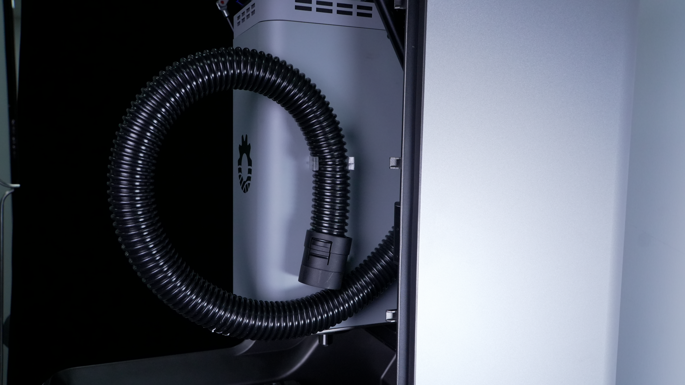
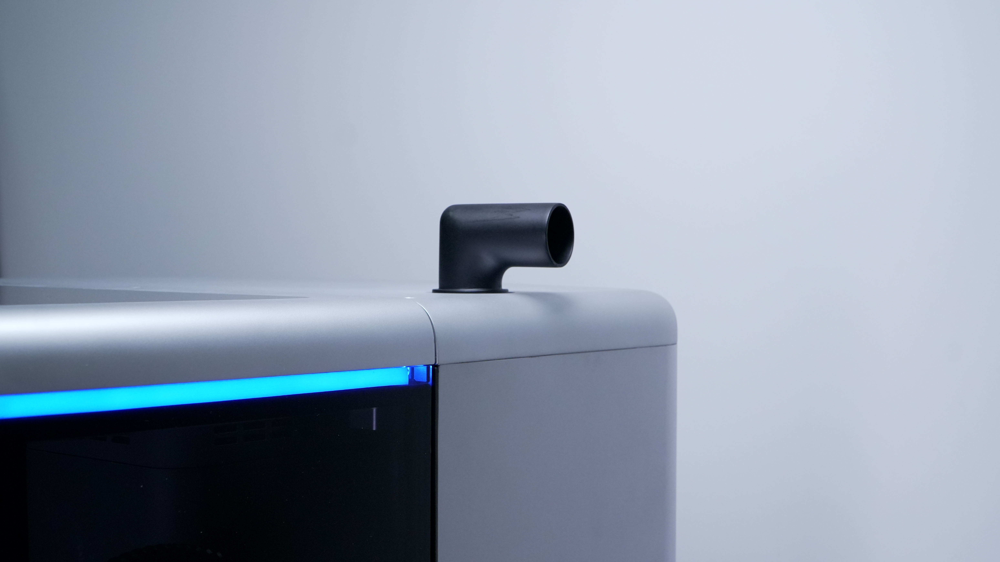
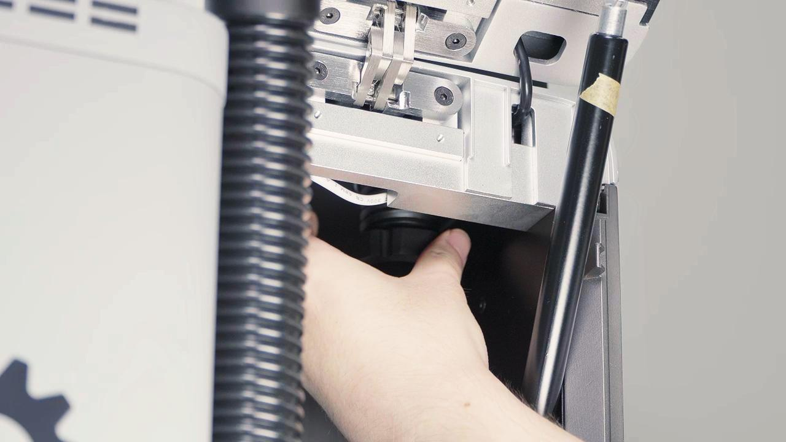
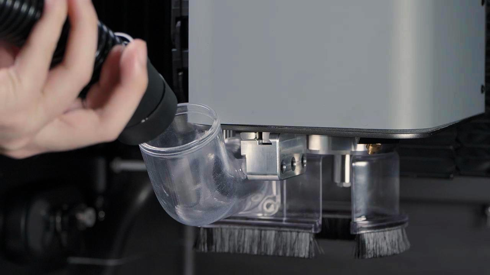

### 吸尘器套件安装

吸尘器组件用于收集雕刻过程中产生的碎屑与粉尘，保持工作区域清洁，减少粉尘对设备及操作环境的影响。

**安装前准备**

安装前，请确认吸尘器组件齐全：吸尘器主机、吸尘管、吸尘口接头及固定卡扣。  

**安装步骤**

1. 将吸尘口插槽对准主轴上的安装槽插入。插入过程中出现明显卡止感时，表示安装到位。  

{width=10cm}

2. 将毛刷支架安装至工作台面左上角，并拧紧手拧螺丝。
  
> [!caution] 注意
> 安装集尘毛刷后，仅可加工表面最大高度差不超过 20 mm 的工件。若超过该范围，请在加工前拆除集尘毛刷。

3. 将 L 型转接管插入机壳右上方圆孔，并使用手拧螺母锁紧固定。  

{width=10cm}

4. 将吸尘管带螺纹的一端与 L 型转接管进行螺纹连接并拧紧。  
  
{width=10cm}

5. 将吸尘管另一端插入吸尘毛刷尾部接口，完成安装。  
  
{width=10cm}

**使用与清洁**  
  
- 加工过程中，建议开启吸尘器，及时清除加工产生的碎屑与粉尘，避免粉尘堆积影响加工精度及设备寿命。  
  
- 加工完成后，关闭吸尘器并断开电源，及时清理集尘盒中的碎屑与粉尘，同时清洁吸尘管及吸尘口，避免堵塞。  
  
- 建议定期检查吸尘器滤网状态。当滤网堵塞时，应及时清理或更换，以保证吸尘器吸力正常。

