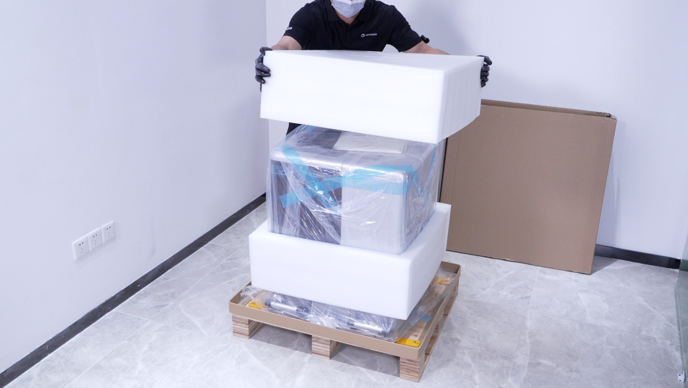

#### 拆除外部包装与防护材料

完成外包装检查并确认包装完好后，按以下步骤拆除运输防护材料。拆除过程中应避免使用尖锐工具直接接触机身、防护门、摄像头、探针等部件，防止划伤或损坏设备。

1. 拆除外部木箱。准备一字螺丝刀和虎口钳，将螺丝刀插入卡扣孔位撬起卡扣，再使用虎口钳夹住并拉直卡扣。

{width=10cm}

2. 检查设备内包装防护状态。设备主机外侧包裹有专用防尘袋，设备四周及边角位置由专用珍珠棉进行防护，用于缓冲运输过程中的震动与撞击。

3. 检查防尘袋是否完整，无破损、开裂；检查边角珍珠棉是否贴合设备，无移位、碎裂或脱落。确认设备整体防护结构完好，无运输移位或防护失效等情况。

4. 确认内包装防护状态正常后，拆除设备外侧珍珠棉等防护材料，轻轻取下设备外侧防尘袋。

{width=10cm}

