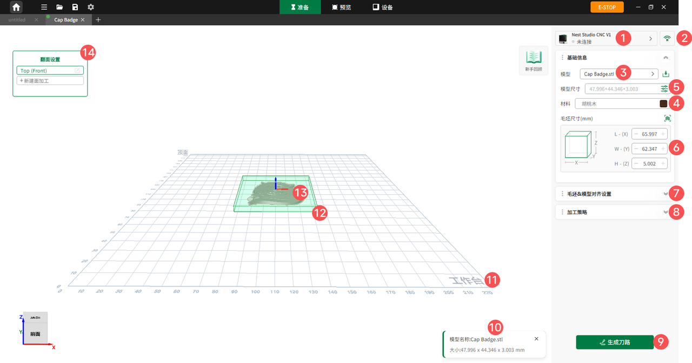

### 准备页面

点击主页顶部工具栏中央的**准备**进入准备界面，针对模型尺寸、材料选择及工艺参数等准备工作进行精确的参数调节。

{width=12cm}

<!-- mdwb:figure id=d589be2c538747e1 -->
图 6-5 准备页面
<!-- /mdwb:figure -->

| 序号  | 功能         | 说明                                                      |
| --- | ---------- | ------------------------------------------------------- |
| 1   | **设备连接状态** | 显示当前设备连接情况。                                             |
| 2   | **设备连接**   | 若设备未连接，用户可点击此处，通过有线或无线方式连接设备。                           |
| 3   | **多个模型选择** | 当导入多个模型时，用户可通过下拉框选择所需模型。                                |
| 4   | **材料选择**   | 用户可选择加工材料，查看 CNC 加工材料相关说明。在连接设备的情况下，扫描材料二维码自动填充材料及尺寸信息。 |
| 5   | **模型尺寸设置** | 调整导入模型的尺寸。                                              |
| 6   | **材料尺寸设置** | 手动设置材料尺寸。                                               |
| 7   | **模型位置设置** | 设置模型在工作台上的位置及旋转角度。                                      |
| 8   | **加工策略**   | 可选择一键智铣、自定义设置，或在高级部分调整加工工艺参数。                           |
| 9   | **生成刀路**   | 点击生成刀路，实现模型的刀路生成及预览。                                    |
| 10  | **文件信息**   | 显示导入或打开文件的信息，包括模型名称及尺寸。                                 |
| 11  | **工作台**    | 展示加工工作台视图。                                              |
| 12  | **毛坯**     | 显示毛坯视图。                                                 |
| 13  | **模型**     | 展示模型视图。单个模型未新建加工面时显示为淡绿色；新建加工面后，加工面显示为黄色高亮。             |
| 14  | **加工面设置**  | 默认加工正面，用户可新建加工面。                                        |

