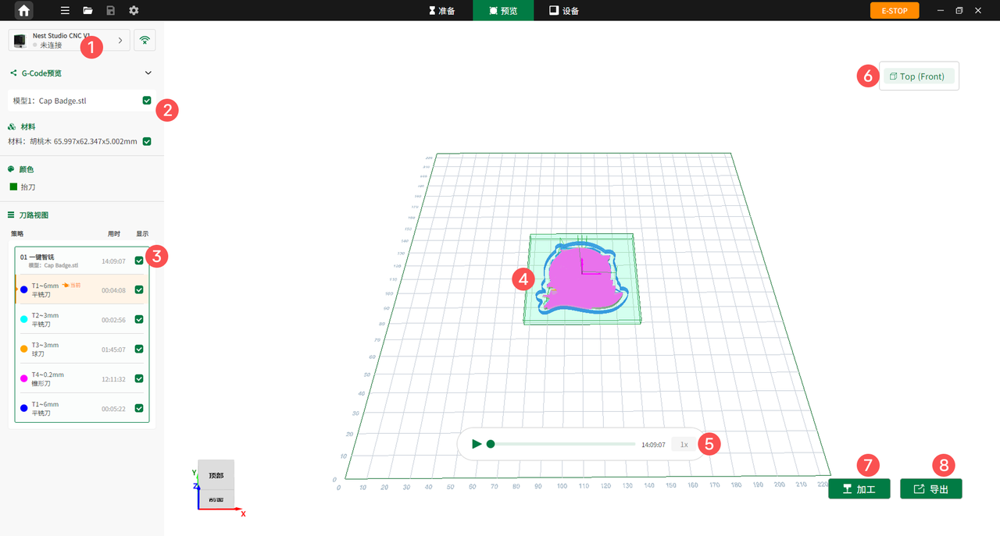

### 预览页面概览

点击主页顶部工具栏中央的**预览**进入预览界面。查看生成的刀路效果、策略参数及加工路径，并支持直接加工或导出 G-code 文件。

{width=12cm}

<!-- mdwb:figure id=cd90739f30dc5f37 -->
图 6-6 预览页面概览
<!-- /mdwb:figure -->

| 序号  | 功能           | 说明                                                    |
| --- | ------------ | ----------------------------------------------------- |
| 1   | **设备连接状态**   | 显示当前设备连接情况。若设备未连接，可点击右侧图标通过有线或无线方式连接设备。               |
| 2   | **刀路视图预览设置** | 可选择显示或隐藏模型与材料的显示状态。                                   |
| 3   | **策略**       | 显示刀具每一步加工策略，包括刀具类型及尺寸、主轴转速、进给速率、下刀速率、每层切割深度、步进量和下刀角度。 |
| 4   | **刀具路径**     | 显示刀具加工路径。                                             |
| 5   | **预览加工视频倍速** | 设置刀路视频播放速度，默认 1x，可选择 0.25x、0.5x、2x、4x、8x、16x 或 32x。   |
| 6   | **加工面**      | 可选择需要加工的面。                                            |
| 7   | **加工**       | 在设备连接状态下，点击开始加工。                                      |
| 8   | **导出**       | 点击导出 G-code 文件。                                       |

