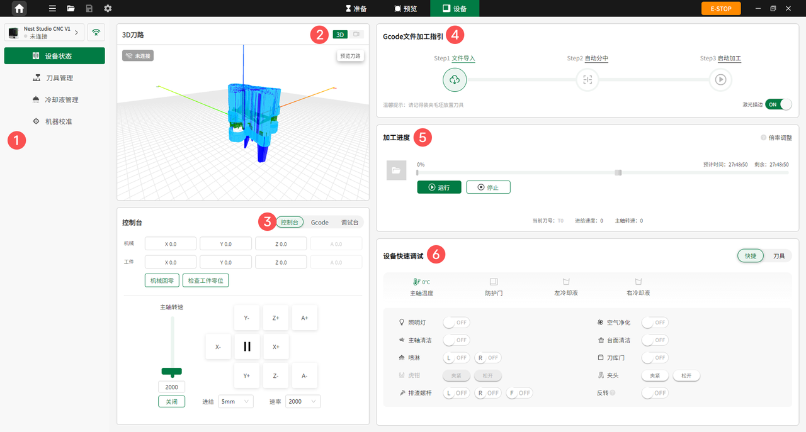

### 设备页面

点击主页顶部工具栏中央的**设备**进入设备界面，可实时监控加工视频，查看加工步骤指引与进度，并对设备进行快速调试与参数干预。

{width=12cm}

<!-- mdwb:figure id=70966ed3291ebfae -->
图 6-7 设备页面
<!-- /mdwb:figure -->

| 序号  | 功能            | 说明                                                                    |
| --- | ------------- | --------------------------------------------------------------------- |
| 1   | 左侧菜单栏         | 查看设备状态、刀具管理、冷却液管理以及机器校准等功能。                                           |
| 2   | 加工视频监控        | 实时监控加工视频，并可预览刀路路径。                                                    |
| 3   | 控制台           | 调试机械坐标或工件坐标，设置机械回零，检查工件零位，并可设置主轴转速及进给速度。                              |
| 4   | G-code 文件加工指引 | 按照导入文件、自动分中、启动加工的流程，指导用户完成加工操作。                                       |
| 5   | 加工进度          | 显示加工进度，包括预计加工时长、剩余加工时长，以及当前加工时间的刀号、进给速度和主轴转速。                         |
| 6   | 设备快速调试        | 快速调节设备，包括开启或关闭照明灯、空气净化、主轴清洁、台面清洁、喷淋、刀库门、虎钳、夹头、排渣螺杆等，并可进行对刀、还刀、零位重设操作。 |

