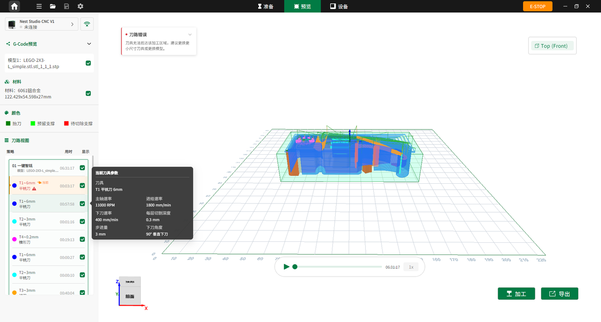

### 3D刀路预览

在预览界面中，可直观查看动态刀路轨迹、预计加工时长及刀具路径分布。  
点击 **导出** 可一键导出 G-code 文件。  

预览界面分为左侧项目信息与刀路管理面板、右侧3D刀路仿真视图区两大部分。默认状态下，界面显示全部刀路的仿真效果；如需查看单个刀具路径，可仅勾选目标对象查看。

{width=12cm}

<!-- mdwb:figure id=fdff40c4ba10b1d3 -->
图 6-14 3D刀路预览
<!-- /mdwb:figure -->

