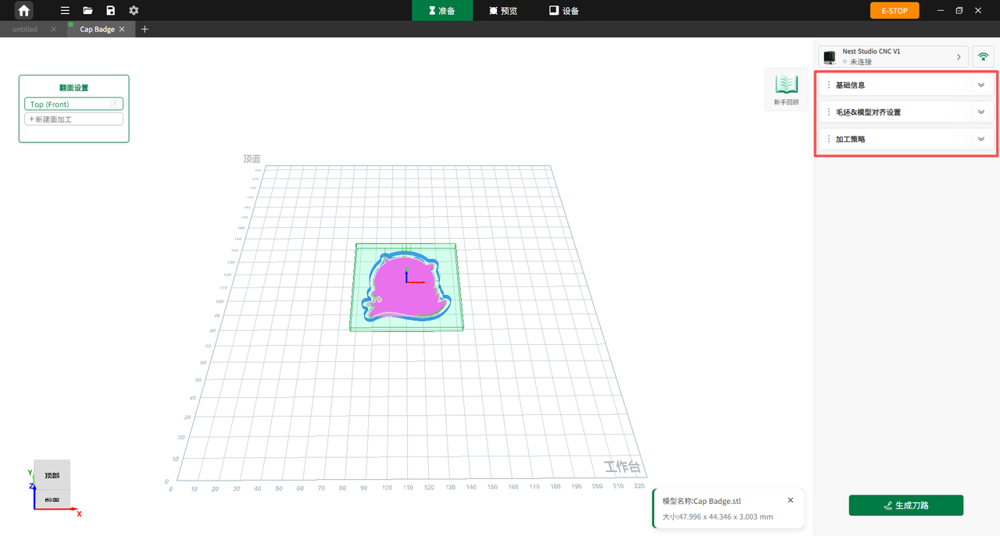

#### 参数设置概览

参数设置面板包含毛坯、模型及工艺三大核心部分：

{width=12cm}

<!-- mdwb:figure id=af2fe76ca64ad85c -->
图 6-11 参数设置概览
<!-- /mdwb:figure -->

**毛坯**

在毛坯设置卡片中，用户可以手动填入毛坯的长（**X**）、宽（**Y**）、高（**Z**）数值，或使用智能识料功能扫描材料上的二维码进行数值自动填充。
* 毛坯显示开关：用户可通过控制该开关，直观查看模型与毛坯的相对位置，更好地辅助加工判断。
* 遮罩层开启：开启后，毛坯将作为遮罩，仅显示毛坯范围内的刀路与模型，并隐藏超出部分，便于用户快速排查刀路越界、余量不足等问题。

**模型**

在模型设置卡片中，用户可调整模型摆放位置（**X**/**Y**/**Z**轴）与旋转朝向，确保加工精准不偏离，最大化利用材料：

* 位置微调：用户可通过输入框内的 **+/-** 按钮或手动填入数值，精准调整模型在毛坯平面上的前后、左右及上下位置。
* 旋转设置：用户可通过手动输入旋转角度，或点击固定值，使模型绕 **X轴**、**Y轴** 或 **Z轴** 进行朝向调整。

> [!note] 提示
> 调整位置或旋转角度时，准备页面的左侧视图会实时发生同步变化。旋转完成后，模型的尺寸和数值会自动更新，无需用户额外修改。

**工艺**

模型导入后，软件会自动解析模型特征并生成对应的工艺策略。工艺卡片主要包含一键智铣与高级两大模块，支持针对单个模型进行刀具、支撑和冷却液的精细化设置。

