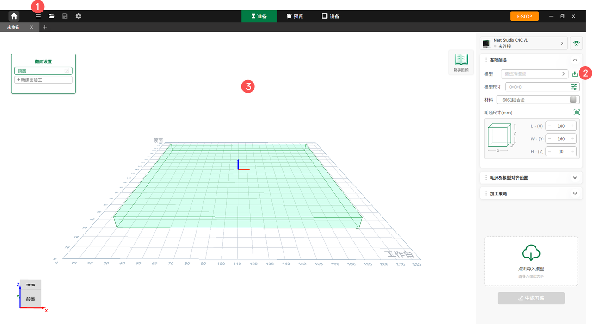

#### 导入方式

软件提供以下三种方式导入模型：

1. **工具栏导入**：点击顶部工具栏中的第二个图标**文件**，选择**导入**，并根据文件类型进行选择：
   * **导入 3D 图纸**：页面将弹出窗口，由用户选择创建 **3轴** 或 **4轴** 布局界面。
   * **导入程序**：系统将自动跳转至设备状态页。
2. **参数面板导入**：点击右侧参数面板中的**导入**图标进行模型导入。
3. **拖拽导入**：直接从电脑桌面将目标文件拖拽至软件工作区内完成导入。

{width=12cm}

<!-- mdwb:figure id=eed989bb3d307ea6 -->
图 6-10 导入方式
<!-- /mdwb:figure -->

