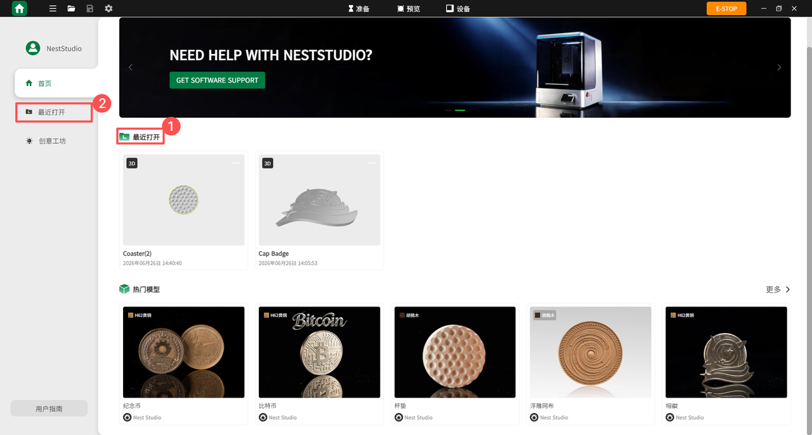
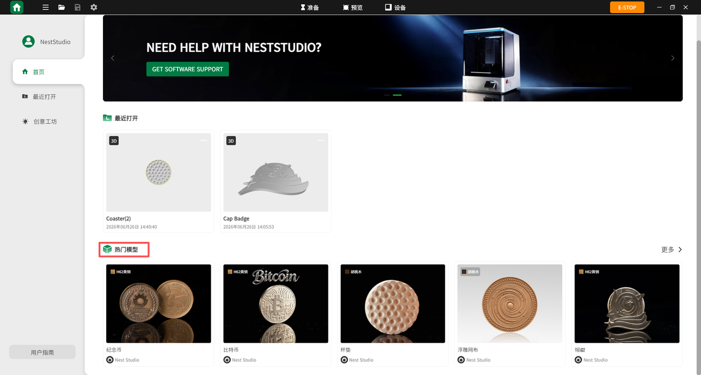
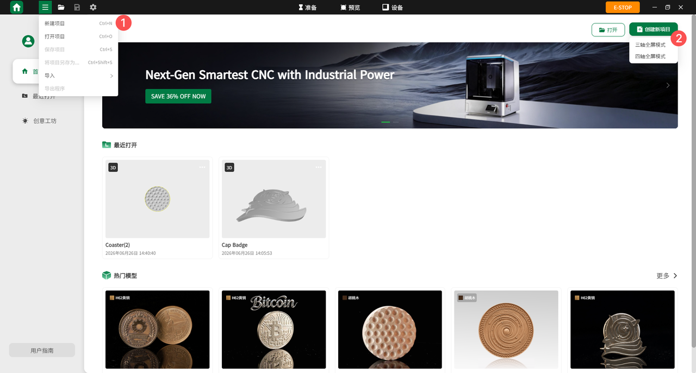
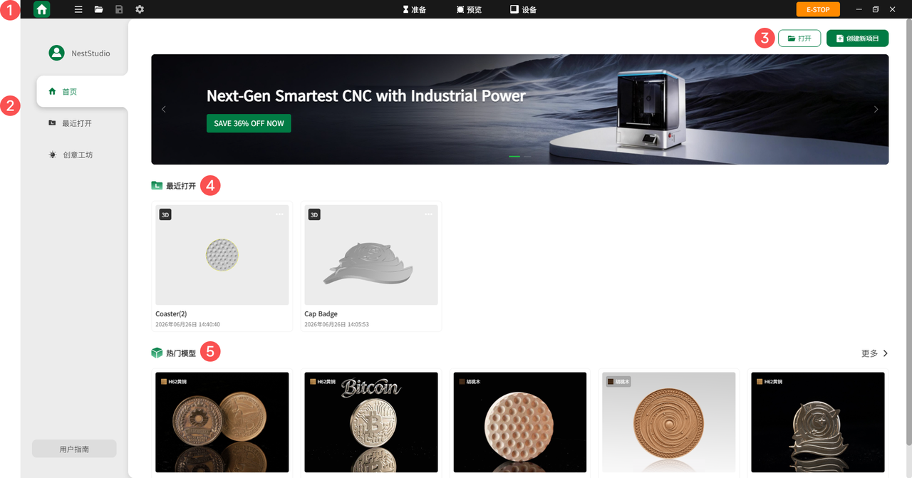

### 首页

**登录账户**  

登录 NestStudio 账号后，可使用积分、钱包及收益功能，并访问云空间。

**查看最近项目**  

快捷打开最近编辑或使用的项目文件。

{width=12cm}

<!-- mdwb:figure id=cbf9383a5f34d661 -->
图 6-1 查看最近项目
<!-- /mdwb:figure -->

**查看热门模型**  

浏览热门模型，单击即可打开感兴趣的模型。

{width=12cm}

<!-- mdwb:figure id=670eeabc3df4278f -->
图 6-2 查看热门模型
<!-- /mdwb:figure -->

**创建新项目**  

快速创建新的 NestStudio 项目。

{width=12cm}

<!-- mdwb:figure id=4ab46fb713262b9a -->
图 6-3 创建新项目
<!-- /mdwb:figure -->

**打开本地文件**  

支持所有 NestStudio 文件、3D 文件及 NestStudio 项目包。

**软件设置**  

根据使用习惯，自定义调整软件的各项偏好参数。

**窗口操作**  

可对窗口进行最小化、最大化及关闭操作。

**云空间访问**  

点击用户头像进入云空间，可查看草稿箱或已创建的文件夹，并同步查看最新项目。

**主页界面布局**

{width=12cm}

<!-- mdwb:figure id=78f114cd8cc92e87 -->
图 6-4 主页界面布局
<!-- /mdwb:figure -->

| 序号  | 功能       | 说明                                     |
| --- | -------- | -------------------------------------- |
| 1   | 主工具栏     | 包含 HOME、新建项目、导入图纸、导出程序、保存文件、急停、账号设置、设置 |
| 2   | 菜单栏      | 包含登录账号、首页、最近打开文件、创意工坊、用户指南、创作者中心、商城    |
| 3   | 打开/创建新项目 | 打开本地文件或创建新项目                           |
| 4   | 最近打开     | 快速访问最近保存的文件                            |
| 5   | 热门模型     | 查看热门模型文件，并可直接打开                        |

