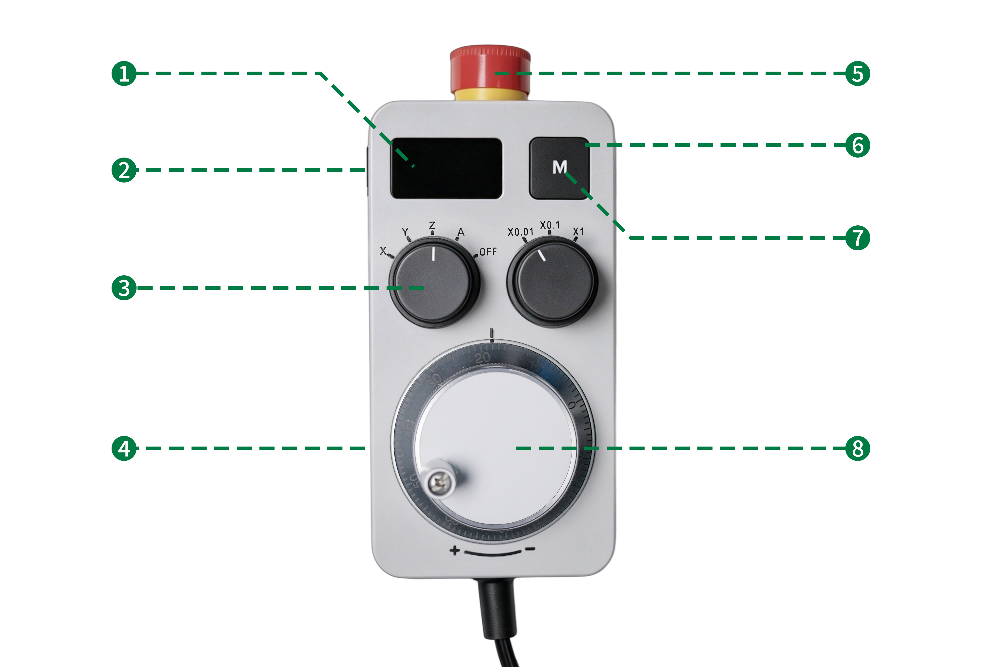

### 手轮连接（选配）

手轮用于对设备进行精确手动控制，可辅助完成对刀、工件定位等操作。

> [!danger] 危险
> 手轮不支持热插拔。连接或断开手轮前，必须确保设备已断电。严禁在设备通电状态下插拔手轮。

**安装步骤**

1. 将手轮弹簧线末端插头对准设备手轮接口，使插头红点与插座红点对齐，平稳轻插至插头完全咬合到位。

{width=10cm}

2. 启动设备并进入控制系统。切换至手轮控制模式，依次测试三轴手动移动，确认手轮运动方向、操控灵敏度响应正常。

{width=12cm}

| 序号  | 名称        |
| --- | --------- |
| 1   | 屏幕        |
| 2   | Type-C 接口 |
| 3   | 旋钮        |
| 4   | 手轮外壳      |
| 5   | 急停按钮      |
| 6   | 交互确认按钮    |
| 7   | 导光标识      |
| 8   | 手轮转盘      |

**软件使用说明**

- 手轮控制模式下，可通过转动手轮精确控制 X、Y、Z 轴移动，用于对刀、工件定位等精细操作。
- 手轮设有旋钮，可切换控制 X、Y、Z 轴；转动速度决定轴移动速度，转动角度决定轴移动距离。
- 使用完成后，可切换自动控制模式，手轮停止工作，不影响设备正常自动加工。

**断开连接**

1. 确认设备已停止运行并处于待机状态。

2. 握住插头前端防滑纹路位置，平稳向后拉出，将插头与航空插座分离。

