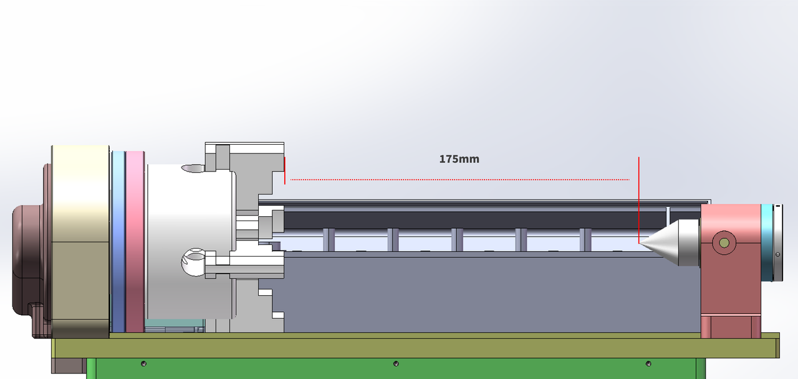
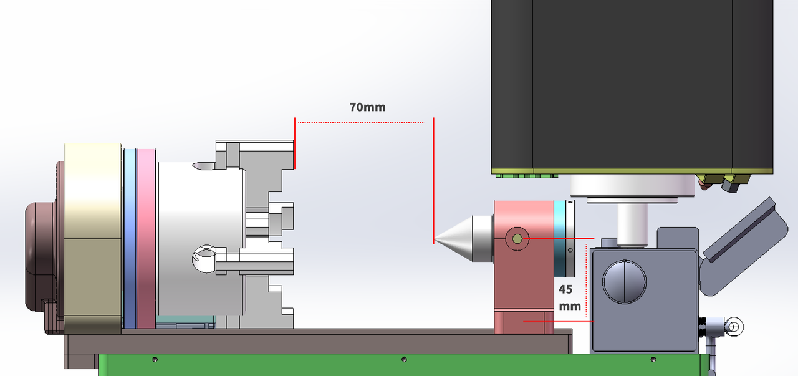
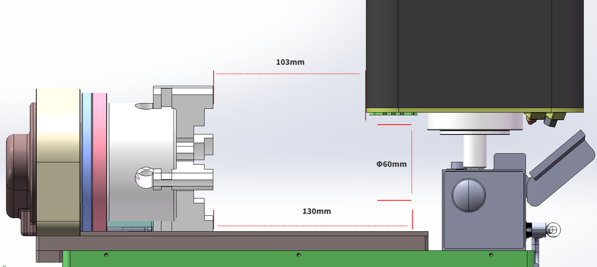

### 第四轴加工尺寸

1. 刀库沿 Y 轴放置，使用顶针  

夹持 Φ80 mm 毛坯时，最大可加工直径为 Φ100 mm，X 向可加工长度为 175 mm。

{width=10cm}

<!-- mdwb:figure id=ec5f140190b1ca0c -->
图 9-4 第四轴加工尺寸
<!-- /mdwb:figure -->

2. 刀库位于 X 轴右侧，使用顶针  

刀库位于 X 轴右侧并使用顶针时，X 向可加工长度为 70 mm。

{width=10cm}

<!-- mdwb:figure id=93fe31f0a0f2bebc -->
图 9-5 第四轴加工尺寸
<!-- /mdwb:figure -->

3.刀库位于 X 轴右侧，不使用顶针  
刀库位于 X 轴右侧且不使用顶针时，可加工长度与毛坯直径有关：
- 毛坯直径为 Φ60–Φ100 mm 时，X 向可加工长度为 103 mm。
- 毛坯直径小于 Φ60 mm 时，X 向可加工长度为 130 mm。

{width=10cm}

<!-- mdwb:figure id=2f42037123485e59 -->
图 9-6 第四轴加工尺寸
<!-- /mdwb:figure -->

