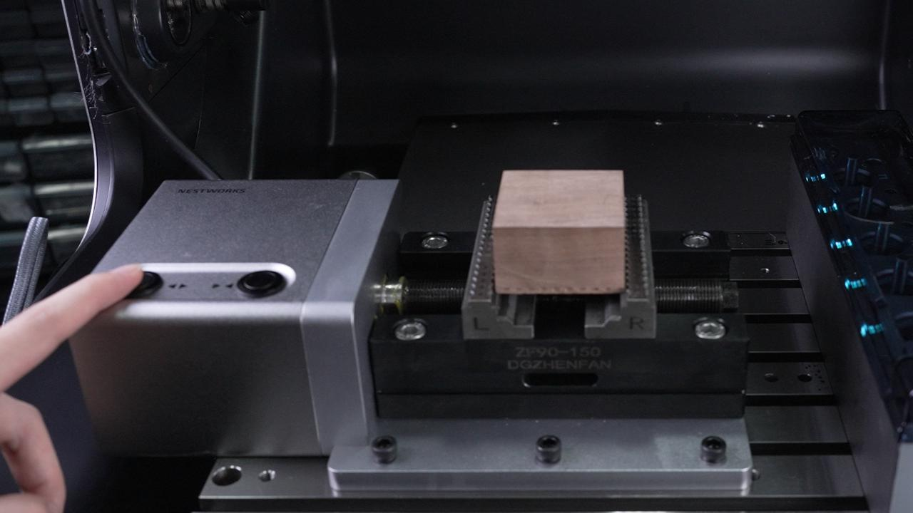
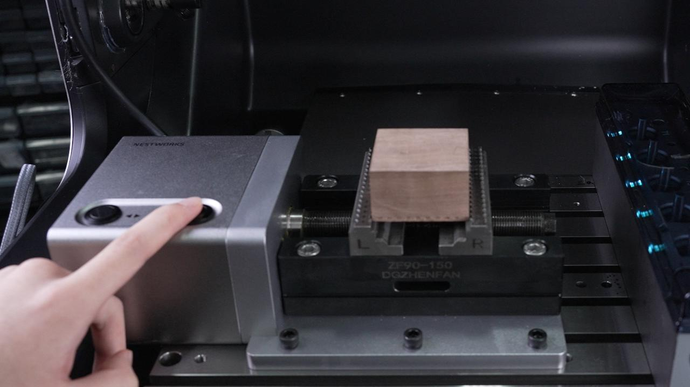
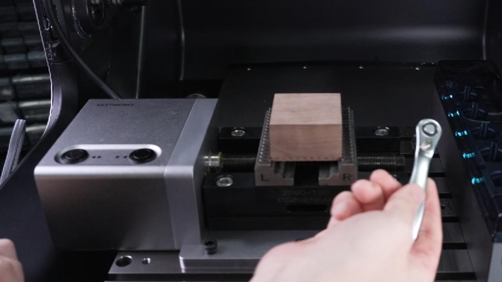
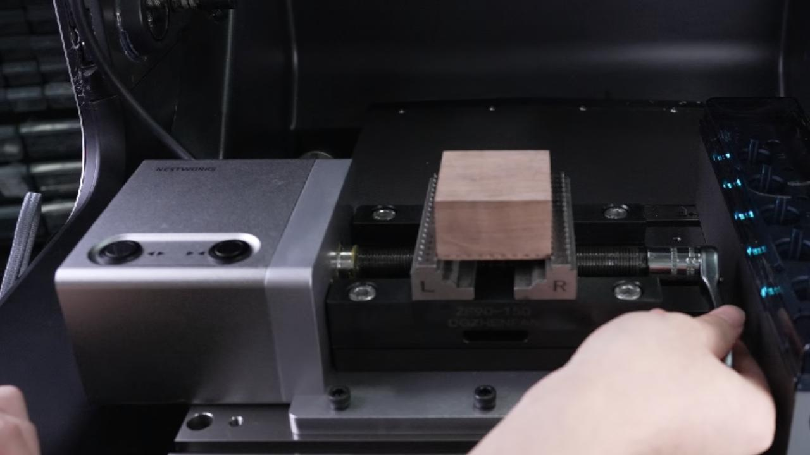

### 工件装夹

电动虎钳配备“夹紧”与“松开”控制按钮。

1. 点击虎钳上的**松开**按钮，将虎钳调整至适合放置胚料的开口距离。

{width=10cm}

2. 将胚料放置于虎钳夹持区域后，长按**夹紧**按钮，对工件进行初步夹持。

{width=10cm}

3. 虎钳夹紧胚料至小屏幕弹出“请用扳手夹紧胚料”提示后，使用随机附带的专用扳手拧紧虎钳。

{width=10cm}

4. 加工完成后，先使用扳手松开虎钳，再长按**松开**按钮，取下工件。

{width=10cm}
